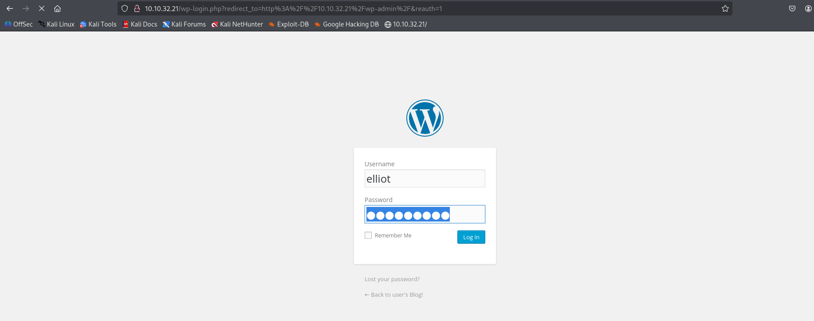

# Mr Robot CTF

**Platform:** TryHackMe  
**Difficulty:** Medium  
**IP:** 10.10.32.21 

---

## 1. Información Inicial
- **Objetivo:** Obtener las tres llaves mediante pruebas de penetración.  
- **Herramientas iniciales:** `nmap`, `gobuster`, `wget`, `hydra`, `reverse shell`, `gtfobins`, `crackstation`, `netcat`, `find`.

---

## 2. Reconocimiento y enumeración

Primero realizamos un escaneo básico con `nmap` para identificar los servicios abiertos:
```bash 
nmap -sC -sV -T5 10.10.32.21
```


Podemos ver como están abiertos los puertos 22, 80 y 443. Vamos a acceder al sitio web por el puerto 80 para ver que encontramos.


En el sitio web no encontramos nada relevante, por lo que realizamos un descubrimiento de directorios con `gobuster`, usando el parámetro `-x` para que nos muestre también ficheros TXT, PHP y HTML.

```bash 
gobuster dir -u http://10.10.32.21 -w /usr/share/wordlists/dirbuster/directory-list-2.3-medium.txt -x txt,php,html
```


En el resultado de esta herramienta podemos observar sitios interesantes como:
- /wp-login (inicio de sesión de WordPress)
- /admin
- /license
- /robots.txt

## 3. Explotación

Primero vamos a entrar al fichero `robots.txt` (http://10.10.32.21/robots.txt), donde se hayan dos ficheros. El primero es un diccionario (fsocity.dic) y el segundo es la primera llave de la máquina (key-1-of-3.txt)


Entramos a ver la primera llave (http://10.10.32.21/key-1-of-3.txt)


Con el diccionario que nos facilitan, podemos intentar hacer fuerza bruta ingresando el mismo diccionario en usuario y contraseña en el inicio de sesión de WordPress.


Utilizaremos `Hydra` para realizar el ataque de fuerza bruta a los campos de usuario y contraseña.

Este ataque comienza a ejecutarse pero tardaba demasiado (aunque hubiera funcionado de haber tardado menos).

```bash 
hydra -L fsocity.dic -P fsocity.dic 10.10.32.21 http-post-form "/wp-login.php:log=^USER^&pwd=^PASS^&wp-submit=Log In:F=Invalid username"
```


Como alternativa, seguimos mirando en los resultados de `gobuster` y probando diferentes directorios para ver su contenido.

Encontramos dentro del directorio /license la redirección al fichero license.txt, cuyo contenido se basa en una frase provocadora pero que indica que hay algo más en este fichero.

Accedemos al código fuente y vemos un hash al final de la frase, que por su signo final parece ser `base64`.


Para decodificar el hash en base64 podemos usar la herramienta `base64` que viene instalada en Kali Linux.

```bash 
echo "ZWxsaW90OkVSMjgtMDY1Mgo=" | base64 --decode
```


Su resultado es unas credenciales, probablemente para el inicio de sesión del panel de WordPress.



Dando una vuelta por el panel de control nos damos cuenta de que dentro de Appearance podemos editar los Temas, y entre todos los ficheros a modificar en la columna de la derecha tenemos ficheros en PHP.


Probando a modificar y guardar el código, no se aprecia que haga ninguna comprobación. Esto quiere decir que podemos ingresar una `reverse shell` y ejecutar el fichero desde su ubicación mientras escuchamos con `netcat`.


La mítica reverse shell de pentestmonkey (https://github.com/pentestmonkey/php-reverse-shell/blob/master/php-reverse-shell.php) nunca falla, por lo que copiaremos el Raw desde GitHub y lo pegaremos en el editor de temas modificando la dirección IP y el puerto que queramos utilizar.


Pondremos netcat a la escucha desde nuestra máquina por el puerto 1234.
```bash 
nc -lvnp 1234
```

Desde la dirección http://10.10.32.21/wp-includes/themes/TwentyFifteen/404.php ejecutamos la reverse shell y recibiremos la conexión automáticamente en nuestro netcat.


## 4. Postexplotación

Ya tenemos Ya tenemos una reverse shell con la máqunia víctima y entramos como el usuario `daemon`. Este usuario puede ver el directorio personal de robot en el que hay dos ficheros:

- key-2-of-3.txt
- password.raw-md5

El primer fichero contiene la segunda llave pero no tenemos permiso para acceder a él y el segundo cotiene las credenciales del usuario robot, pero con la contraseña codificada en MD5.


El sitio web más conocido para tratar de decodificar un hash MD5 es Crackstation (https://crackstation.net/).


Conseguimos la contraseña del usuario con la que accederemos a la cuenta de robot y podremos leer el fichero que contiene la segunda llave.


Trataremos de buscar ficheros con permisos SUID que se ejecuten con los permisos del propietario y no del usuario que los ejecuta.

```bash 
find / -perm -u=s -type f 2>/dev/null
```


Entre todos los ficheros hay uno que no es tan común encontrar, se trata de `/usr/local/bin/nmap`.

Visitaremos la página más común para escalada de privilegios, GTFObins (https://gtfobins.github.io).

En el buscador escribiremos "nmap" y en la sección de Shell leeremos y seleccionaremos la opción más apropiada, que en este caso es la (b) que puede ejecutarse con comandos de shell.


Ejecutando esos dos sencillos comandos, podemos ver como la respuesta al comando `whoami` es root, y tenemos privilegios de administrador para acceder a la última llave.

```bash 
nmap --interactive
!sh
```


## 5. Conclusiones

- La enumeración exhaustiva con Nmap y Gobuster permitió identificar servicios y directorios críticos sin necesidad de fuerza bruta.
- La máquina mostró la importancia de revisar archivos expuestos como robots.txt.
- Encontrar binarios SUID y revisar permisos de sudo puede llevar a escalada de privilegios rápida.


