# Tomghost

**Platform:** TryHackMe  
**Difficulty:** Easy  
**IP:** 10.10.104.251

---

## 1. Información Inicial
- **Objetivo:** Obtener las tres recetas mediante pruebas de penetración.  
- **Herramientas iniciales:** `nmap`, `ssh`, `Metasploit`, `GPG`, `john`, `GTFOBins`.

---

## 2. Reconocimiento y enumeración

Primero realizamos un escaneo básico con `nmap` para identificar los servicios abiertos:
```bash 
nmap -sC -sV 10.10.104.251
```

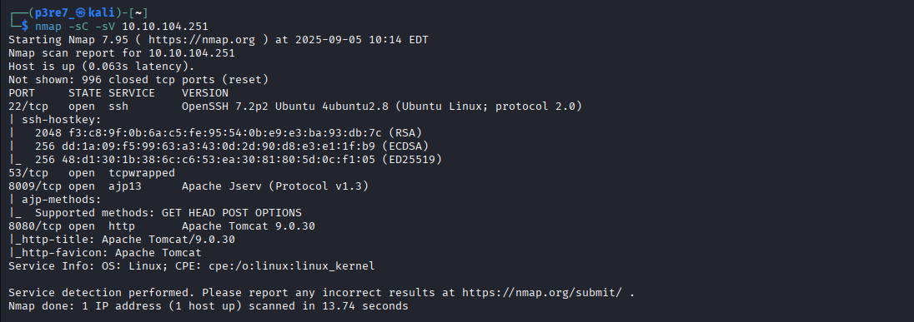

En el escaneo vemos varias cosas que nos llaman la atención, en especial un Apache Jserv en el puerto 8009, cuyo nombre de servicio es ajp13.
Para buscar ese servicio podemos usar tanto searchsploit como Metasploit, yo usaré el segundo por comodidad.

```bash 
msfconsole
search ajp
```
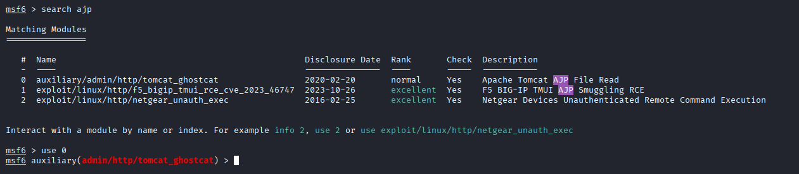

El primero parece ser el que más encaja, tratándose de la lectura de un fichero con Tomcat y teniendo un nombre relacionado con el de la máquina.

```bash 
use 0
set rhosts 10.10.104.251
run
```

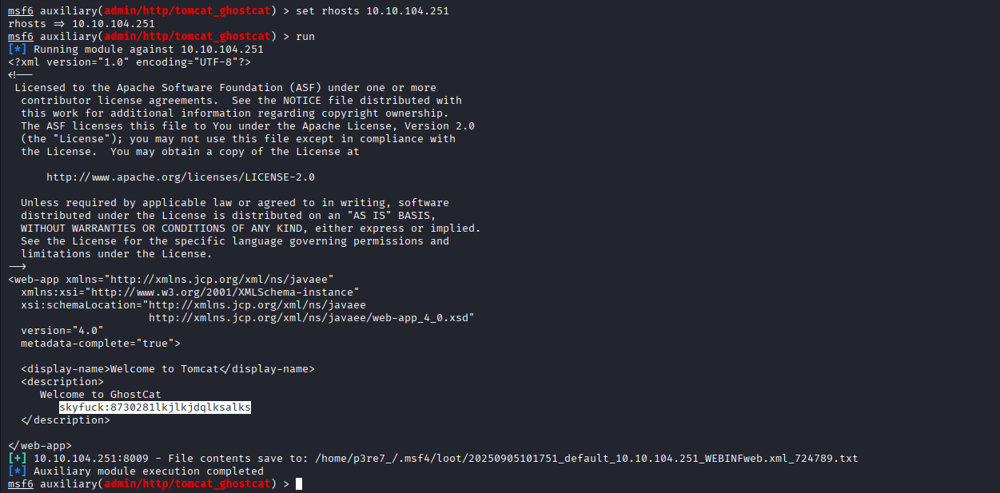

## 3. Explotación


En la opción del fichero a leer dejamos la que venía por defecto y el exploit nos devuelve unas credenciales (`skyfuck:8730281lkjlkjdqlksalks`).

Estas credenciales pueden ser usadas para acceder a la máquina a través de SSH.

```bash 
ssh skyfuck@10.10.104.251
```

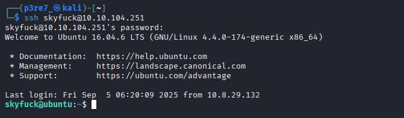

Estando dentro, listamos los ficheros del directorio actual y nos encontramos:
- tryhackme.asc
- credential.php

Tenemos una clave GPG en formato ASCII que nos puede servir para descrifrar el segundo fichero, por lo que la importamos y luego tratamos de desencriptar el fichero credential.pgp

```bash 
gpg --import tryhackme.asc
gpg --decrypt credential.pgp
```

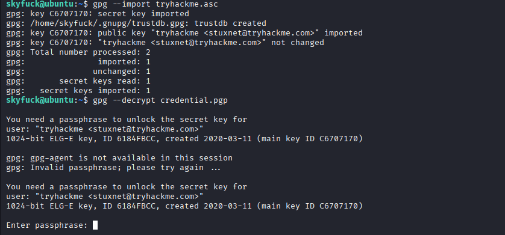

El problema es que nos pide una contraseña que no tenemos. Tras varias pruebas, acabo descargándome el fichero tryhackme.asc por SCP a mi máqunia local para tratar de sacar alguna clave.

Desde nuestra máquina, convertimos el fichero a hash con `gpg2john` y pudiendo trabajar con este, usaremos john para tratar de descifrarlo mediante el diccionario rockyou.txt.

```bash 
scp skyfuck@10.10.104.251:/home/skyfuck/tryhackme.asc .
gpg2john tryhackme.asc > hash
john --format-gpg --wordlist=/usr/share/wordlists/rockyou.txt hash
```

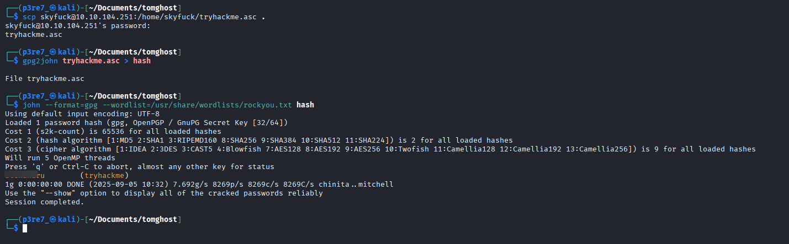

John nos devuelve una contraseña que nos servirá para descifrar el fichero PGP.

```bash 
gpg --decrypt credential.pgp
```

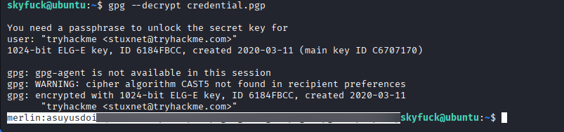

Como resultado obtendremos otra credencial con la que obtendremos mejores permisos en la sesión SSH, de manera que accedemos a la cuenta `merlin`.
En su directorio personal encontramos la primera bandera, la del usuario.

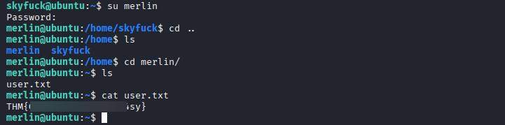

## 4. Postexplotación

Commo en cada escala de privilegios, el comando más común para ver los privilegios con SUDO que tenemos es `sudo -l`.
Con este descubrimos que podemos ejecutar /usr/bin/zip con sudo, lo cuál nos facilita el trabajo teniendo solo que buscar en GTFOBins.

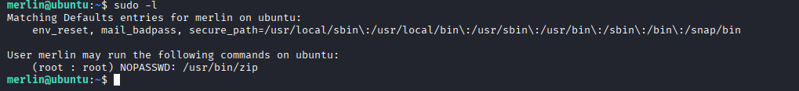

En la página apreciamos entre todas las opciones que hay una para SUDO, por lo que iremos copiando cada línea y pegándola en la sesión.

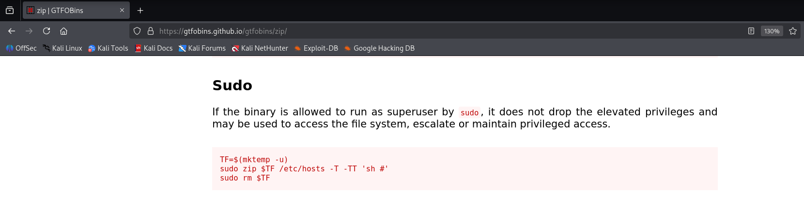

Sin necesidad de ingresar el tercer comando ya tenemos acceso al usuario root, con el que también conseguimos la segunda bandera y finalizamos el laboratorio.

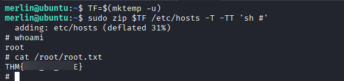
